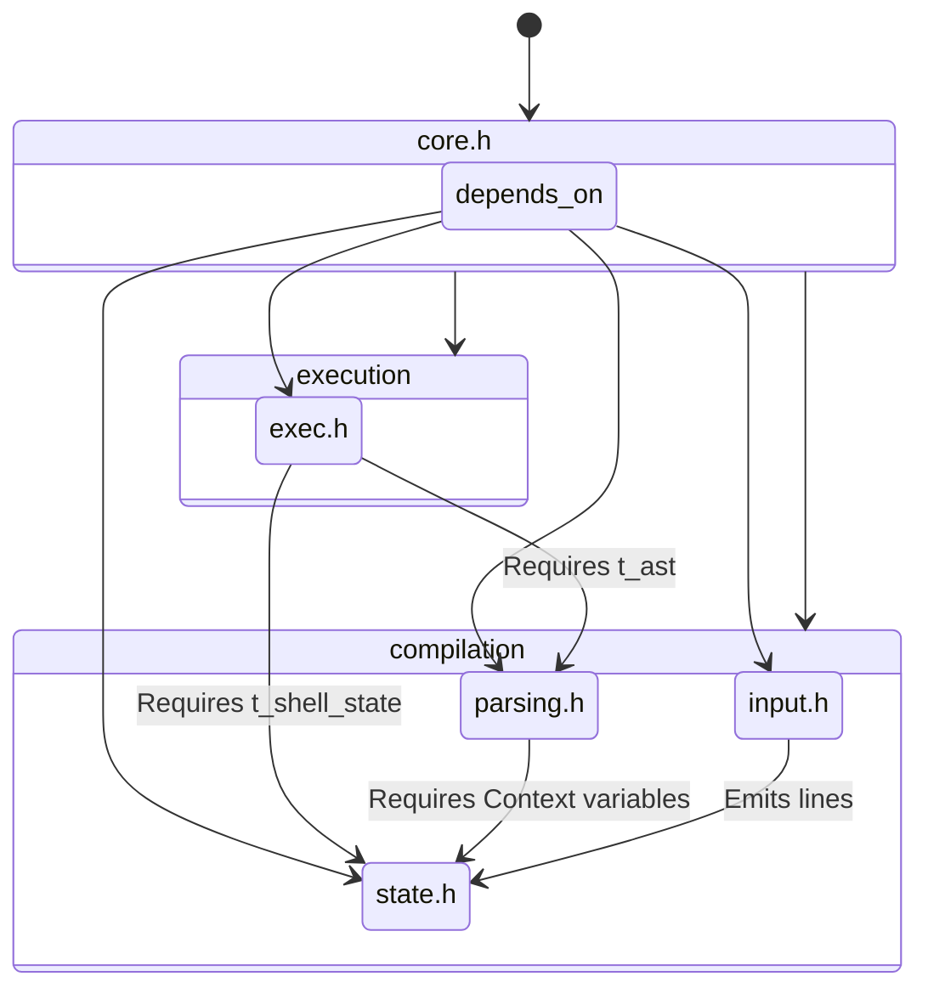

# 🧭 Public Header APIs (`includes/`)

---

## 🏗️ Architecture TL;DR
> The `includes/` directory enforces strict structural boundaries across the Minishell source tree. To prevent spaghetti-code mapping and accidental struct mutation, each module exposes uniquely tailored enumerations and function signatures. This enforces a one-way architectural dependency graph where higher-level modules orchestrate lower-level structures safely.

---

## 🗺️ Data Flow Diagram

---

## 🧱 Subsystems Matrix
| Header File | Core Responsibility | Consumes | Produces |
| :--- | :--- | :--- | :--- |
| **`core.h`** | Global Orchestration | Boot variables | Main Loop Entry logic. |
| **`state.h`** | Central Context struct | `void` | Exports `t_shell_state` universally. |
| **`input.h`** | Reader mappings | OS FDs | Physical text line extraction hooks. |
| **`parsing.h`** | Structural Compilation boundaries | `char *line` | Defines `t_token` and `t_ast` structures physically. |
| **`exec.h`** | Physical OS execution linkages | `t_ast *root` | Defines Heredoc and Export execution wrappers. |
| **`lib.h`** | Global Utility mapping | `void` | Fast, stateless string algorithms. |

---

## 🧠 Global State Strategy
The `includes/` architecture specifically isolates deep state logic inside `state.h`. By forcing `exec.h` and `parsing.h` to implicitly include `state.h`, developers are structurally barred from redefining the master `t_shell_state` footprint, preventing conflicting compiler assumptions during object linking.

---

## 🛡️ Error & Signal Philosophy
> [!IMPORTANT]
> **Minimal Inclusion Boundaries:** Headers explicitly only include what they strictly require. `parsing.h` does not include `exec.h`; they are structurally isolated to prevent cyclical dependencies breaking the compiler graph.

---

## 🗂️ Developer Reading Sequence
To cleanly comprehend the codebase API, read the headers strictly in this structural instantiation order:
1. `state.h` (The context engine)
2. `lib.h` (The data primitives)
3. `parsing.h` (The data representations)
4. `exec.h` (The execution definitions)
5. `input.h` (The pipeline entrance)
6. `core.h` (The execution bridge)