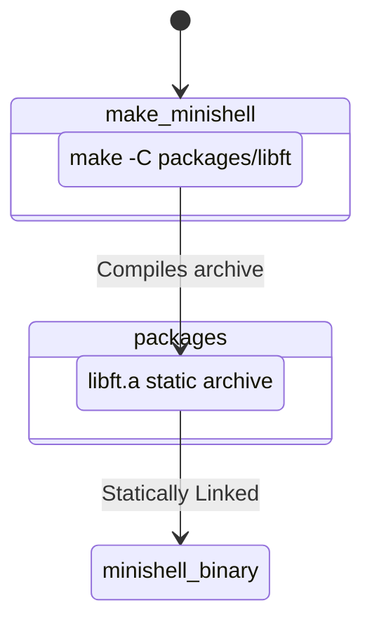

# 📦 Minishell Vendor Packages (`packages/`)

---

## 🏗️ Architecture TL;DR
> **The external package bridge.**  
> Minishell explicitly isolates bundled dependencies inside the `packages/` directory. Rather than muddying the core `srcs/` tree with generic data structure implementations or variadic printing utilities, these are treated as isolated third-party modules that compile statically into `minishell`.

---

## 🗺️ Dependency Flow Diagram

---

## 🧱 Subsystems Matrix
| Subsystem | Core Responsibility | Consumes | Produces |
| :--- | :--- | :--- | :--- |
| **`libft/`** | Standard Library Replacement | Standard types | `libft.a` static binary. |

> **New:** `libft` now exposes a lightweight `srcs/data/` collection (for example `srcs/data/buffer/` and `srcs/data/stack/`) providing `t_buffer`, stack helpers and other in-memory primitives used by the shell.

---

## 🧠 Memory Strategy
Packages operate completely independently of the Minishell `t_shell_state` context. They are entirely stateless, performing primitive memory transformations and allocations without relying on any external parent singletons. The caller (`srcs/`) is strictly responsible for managing any pointers generated by the `packages/` ecosystem.
