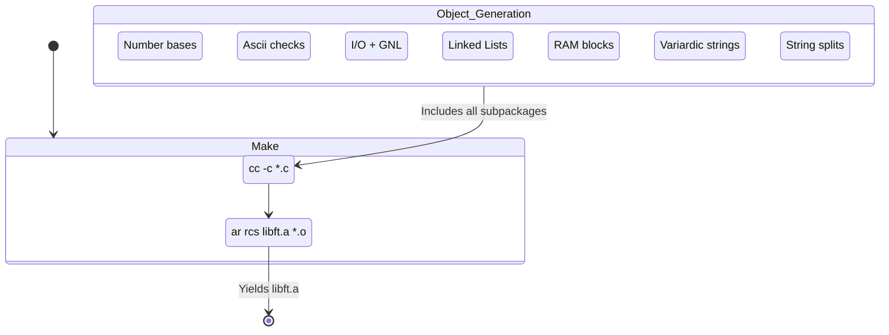

# 🚀 libft — Core Utilities Library


**A friendly, thorough reconstruction of the C standard library used across 42 School projects. This document combines the approachable style of the "README copy" with the technical completeness of the original README.**

---

## 📋 Table of Contents

- [Overview](#overview)
- [Architecture (TL;DR)](#architecture-tldr)
- [Build & Compilation Flow](#build--compilation-flow)
- [Quick Build](#quick-build)
- [Subsystems](#subsystems)
- [Global Memory Strategy](#global-memory-strategy)
- [Error & Safety Philosophy](#error--safety-philosophy)
- [Project Structure & Full File List](#project-structure--full-file-list)
- [Usage Examples](#usage-examples)
- [Testing & Commands](#testing--commands)
- [Contributing & Acknowledgments](#contributing--acknowledgments)

---

## Overview

`libft` reimplements essential parts of the C standard library and provides small, well-tested helpers (memory, string, character, I/O helpers, number conversions and `t_list` utilities). The library is distributed as a static archive (`libft.a`) intended for reuse in other projects.

---

## Architecture (TL;DR)

`libft` focuses on correctness, clarity, and Norminette-friendly structure. It avoids global state, keeps functions small and testable, and provides a consistent ownership model for heap allocations.

---

## Build & Compilation Flow



---

## Quick Build

From the `utils/libft` directory:

```bash
make        # build libft.a
make bonus  # build bonus objects if supported
make clean  # remove object files
make fclean # remove object files and libraries
make re     # fclean && make
```

---

## Subsystems

| Subsystem | Responsibility |
| :--- | :--- |
| `includes/` | Public API and typedefs (e.g. `t_list`) |
| `srcs/mem` | Memory helpers (`ft_memset`, `ft_memcpy`, `ft_calloc`, etc.) |
| `srcs/data` | Higher-level data utilities (buffers, strings, lists, stacks) |
| `srcs/char` | Character predicates and conversions (`ft_isalpha`, `ft_toupper`, etc.) |
| `srcs/nb` | Number parsing/formatting (`ft_atoi`, `ft_itoa`, base helpers) |
| `srcs/put` | Output helpers (fd writers, printf implementation, get_next_line) |

---

## Global Memory Strategy

- Zero globals (except tightly-scoped static buffers where absolutely necessary).
- Heap ownership is transferred to the caller for functions that allocate memory.
- Functions mutate only caller-provided buffers within caller-specified bounds.

---

## Error & Safety Philosophy

- Defensive pointer checks to return safe values on `NULL` inputs where practical.
- Norminette-friendly coding: small functions, limited variables, clear responsibilities.

---

## Project Structure

Top-level layout (concise):

```
utils/libft/
├── Makefile        # build targets: all, bonus, clean, fclean, re
├── includes/       # public headers (libft.h and helpers)
├── srcs/           # categorized source directories (mem, data, put, char, nb, ...)
├── objs/           # generated object files
└── libft.a         # built static archive (output of `make`)
```

Important directories and highlights:

- `srcs/mem/` — low-level memory helpers (`ft_memset`, `ft_memcpy`, `ft_calloc`, `ft_bzero`, etc.).
- `srcs/data/` — higher-level utilities (string helpers, buffers, stacks, and `t_list` helpers).
- `srcs/put/` — I/O helpers: `ft_putchar_fd`, `ft_putstr_fd`, `get_next_line`, and a `printf` implementation.
- `srcs/char/` — character predicates and conversions (`ft_isalpha`, `ft_toupper`, etc.).
- `srcs/nb/` — number parsing and base utilities (`ft_atoi`, `ft_itoa`, base conversions).

If you need a full file inventory, run this locally (from `utils/libft`):

```bash
# list all .c files grouped by directory
find srcs -type f -name "*.c" | sed 's|^| - |' | sort

# or produce a compact tree
find srcs -print | sed -e 's;[^/]*/;|____;g;s;____|; |;g'
```

Include this README or the command output in PRs if you want reviewers to see exact file lists.

---

## Usage Examples

Simple program using `ft_strdup`:

```c
#include "libft.h"

int main(void)
{
    char *s = ft_strdup("hello");
    /* use s */
    free(s);
    return 0;
}
```

Compile:

```bash
gcc your_program.c -L. -lft -I includes/
```

---

## Testing & Commands

- `make` — build the static archive
- `make bonus` — include bonus targets if available
- `make clean` / `make fclean` / `make re`

If you want me to run a test or generate a smaller index (e.g., only `.c` files), tell me which format you prefer.

---

## Contributing & Acknowledgments

Contributions should prioritize correctness, memory-safety, and Norminette compliance. Thanks to 42 School and project reviewers.

---

*Merged and expanded per your request.*
