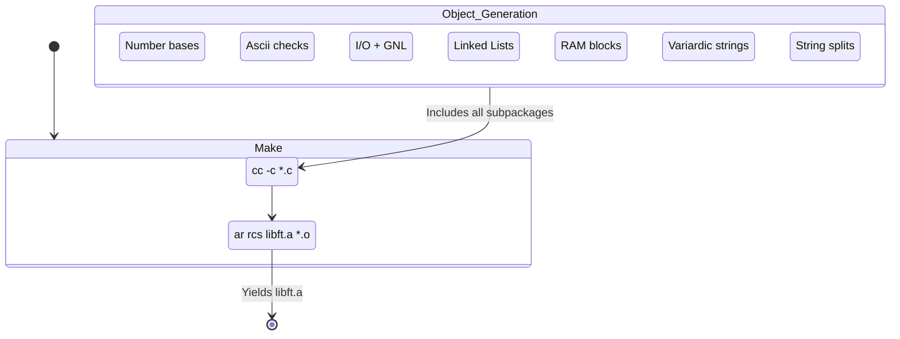

# 📚 Core Utilities Library (`packages/libft/`)

---

## 🏗️ Architecture TL;DR
> **The fundamental building blocks.**  
> `libft` is a comprehensive recreation of the C Standard Library, expanded with custom linked-list drivers, advanced formatting (`printf`), and resilient string manipulation utilities. It operates entirely statically and statelessly, assuming no knowledge of Minishell's specific AST or signal handlers.

---

## 🗺️ Build Compilation Flow

---

## 🧱 Subsystems Matrix
| Subsystem | Core Responsibility | Primary Data Structure |
| :--- | :--- | :--- |
| **`includes/`** | The API Surface | Defines `t_list` natively. |
| **`srcs/base/`** | Number Conversions | `long long` logic. |
| **`srcs/char/`** | ASCII Identifiers | `char` bounds checking. |
| **`srcs/fd/`** | Descriptor I/O | `get_next_line` buffers. |
| **`srcs/int/`** | Integer Arithmetic | Parsing arrays cleanly. |
| **`srcs/lst/`** | List Iterations | `t_list` traversals. |
| **`srcs/mem/`** | RAM copying | `void *` shifting. |
| **`srcs/printf/`** | Formatted Data | Variadic `va_list` parsing. |
| **`srcs/str/`** | String Mutations | Deep `char **` allocations. |
| **`srcs/buffer/`** | Dynamic buffer builder | `t_buffer` growing byte buffer |

Additional grouped data primitives live under `srcs/data/` (e.g. `srcs/data/buffer`, `srcs/data/stack`, `srcs/data/lst`) and consolidate small one-responsibility modules for easier Norminette compliance and review.

---

## 🧠 Global Memory Strategy
Because `libft` is stateless:
- **Zero Globals:** No global variables are permitted (excluding implicit static buffers localized purely in `get_next_line`).
- **Transfer of Ownership:** Any function returning an allocated pointer (e.g. `ft_split`, `ft_strjoin`, `ft_itoa`) strictly **hard-transfers ownership** to the caller. The caller MUST trigger `free()`.
- **In-Place Mutation:** Functions like `ft_bzero` or `ft_strlcpy` mutate memory bounded entirely by the caller.

---

## 🛡️ Error & Safety Philosophy
> [!IMPORTANT]
> **Defensive Pointer Guards:** Unlike standard `libc` functions which often Segfault gracefully, `libft` natively wraps execution blocks with defensive `if (!ptr)` guards where applicable, ensuring graceful `NULL` returns.

> [!CAUTION]
> **Strict Norminette Compliance:** The entire architecture is restricted to 25-line functions and maximum variable counts, forcing extreme code decoupling.
