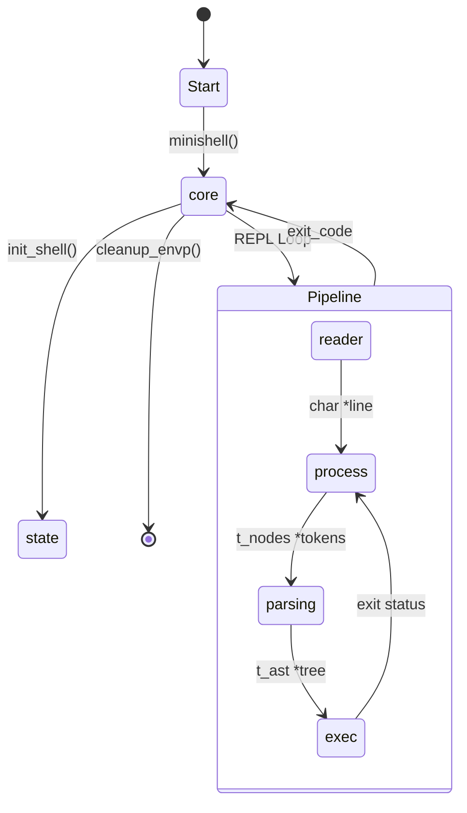

# Minishell Core Pipeline (`srcs/`)

## Architecture TL;DR
The `srcs/` directory implements a classic **Read-Eval-Print-Loop (REPL) with AST Compilation**. The input string is passed through strict, isolated pipeline stages: physical acquisition (`reader`), tokenization and syntax validation (`process`), macro expansion (`parsing`), AST generation, and finally sub-process dispatch (`exec`). State is strictly centralized in a heap-allocated shell state struct to ensure leak-free teardowns.

## Data Flow Diagram

## Subsystems Matrix
| Subsystem | Core Responsibility | Consumes | Produces |
| :--- | :--- | :--- | :--- |
| `core/` | Application entry point and REPL orchestrator. | Startup ARGV / ENVP | Final exit status; pipeline dispatches. |
| `state/` | Duplicates ENVP and toggles global signal modes. | `char **envp` / `SIG` signals | `t_shell_state` and `g_last_signal`. |
| `input/` | Physical line acquisition, syntax analysis, segmentation. | Terminal / stdin streams | Validated, semicolon-delimited token segments. |
| `parsing/` | Sub-token expansion (`$`, wildcards) and AST building. | Validated Token Segments | Execution Trees (`t_ast *`). |
| `exec/` | Walks the AST, pipes FDs, spawns (`fork`) and waits. | `t_ast *` and `t_shell_state` | Exit status codes (mutating `state`). |
| `lib/` | Reusable formatting and error-reporting utilities. | N/A | Prints to `STDERR` / Utility values. |

## Global State Strategy
State ownership is fiercely guarded by the `core/` module. 
- The `t_shell_state` structure is instantiated by `core/` and passed by reference `*state` down the pipeline. 
- **No subsystem is allowed to hoard memory** across REPL loops. At the end of every `get_command_line` cycle, all generated ASTs, token lists, and intermediate strings MUST be freed.
- The `state->envp` array is the only structure allowed to persist across the loop, acting as the memory-safe baseline for the environment.

## Error & Signal Philosophy
- `SIGINT` (Ctrl+C) strictly triggers line resets during the prompt and heredoc cancellation during the execution layer. 
- Graceful degradation: A syntax error in `input/` immediately aborts the token stream but guarantees pending heredocs are safely consumed (POSIX standard), avoiding phantom input locks.