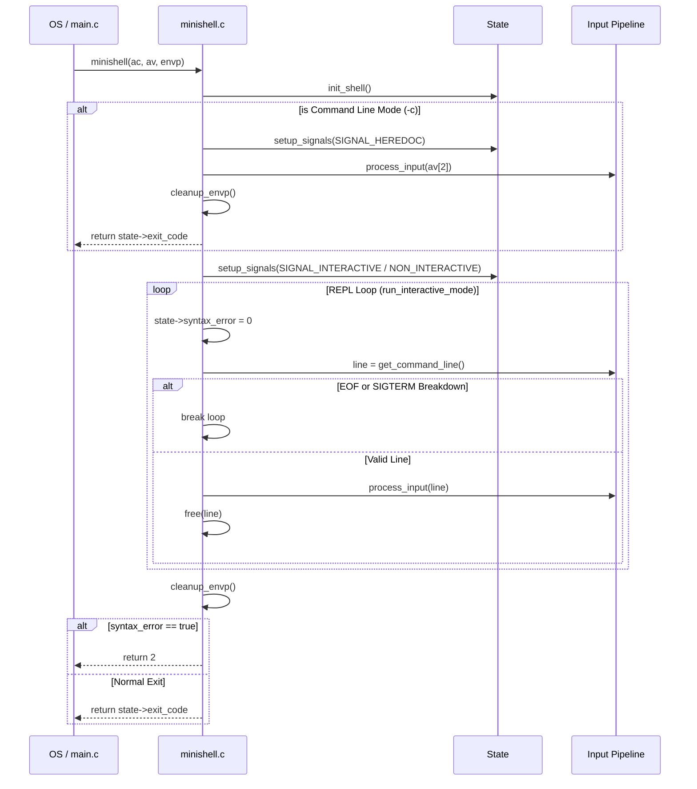

# 📦 Core Module Subsystem (`srcs/core`)

---

## 🚧 Subsystem Boundary
> [!NOTE]
> **Trigger:** Activated directly by the OS binary loader (`main`) with `argc`, `argv`, and `envp`.
> 
> **Output:** Ultimately returns the `exit_code` to the operating system after fully tearing down the `t_shell_state` and duplicated environment variables.

---

## ✅ Responsibilities & ❌ Anti-Responsibilities
- **Must:** Bootstrap the `t_shell_state` through `state/init_shell`.
- **Must:** Own and orchestrate the infinite Read-Eval-Print-Loop (REPL).
- **Must:** Explicitly branch between `-c` direct-execution mode and standard `stdin` execution mode.
- **Must:** Guarantee that `envp` is freed unconditionally when the REPL breaks.
- **Must Not:** Parse strings or build ASTs (delegated to `input/` and `parsing/`).
- **Must Not:** Define or bind the signal handler logic directly (delegated to `state/signals/`).

---

## 🔄 Internal Sequence Diagram

---

## 💾 Memory Contracts (Critical)
| Function Allocates | Freeing Responsibility | Condition |
| :--- | :--- | :--- |
| **`interactive_read_loop()`** | `interactive_read_loop()` | Extracts a freshly allocated `char *line` from `get_command_line()`. It MUST `free(line)` at the bottom of the loop or explicitly before breaking on `SIGTERM`. |
| `init_shell(state.envp)` | **`cleanup_envp(state.envp)`** | `cleanup_envp` explicitly iterates and frees the entire 2D `envp` array on both `-c` execution paths and standard loop breakdowns before `minishell` safely exits. |

---

## 🧬 State Mutation Matrix
| Scenario | Mutated Field | Assigned Value |
| :--- | :--- | :--- |
| Top of every REPL iteration | `state->syntax_error` | `0` (Resetting loop-specific failure traps). |
| OS signals `-c` Mode | **None directly** | Passes `-c` string into `process_input` without mutating interactive flags manually. |

---

## ⚠️ Edge Cases & Gotchas
> [!CAUTION]
> **Terminal Exit Logs:** If `get_command_line` returns `NULL` (EOF via `Ctrl+D`) while `state->interactive_shell == true`, this module explicitly prints `"exit\n"` to `STDERR` before breaking the loop, exactly mimicking Bash syntax.

> [!WARNING]
> **Syntax Error POSIX Override:** If the final segment throws a syntax error (`state->syntax_error == 1`), `minishell` forcibly returns `2` disregarding generic execution codes, complying strictly with POSIX constraint mapping.

---

## 🗂️ Files Inventory
| File | Primary Function | Role |
| :--- | :--- | :--- |
| `main.c` | `main()` | Hollow binary entry point passing control to `minishell.c`. |
| `minishell.c` | `minishell()` | Controls the overarching REPL lifecycle and memory teardown contracts. |
