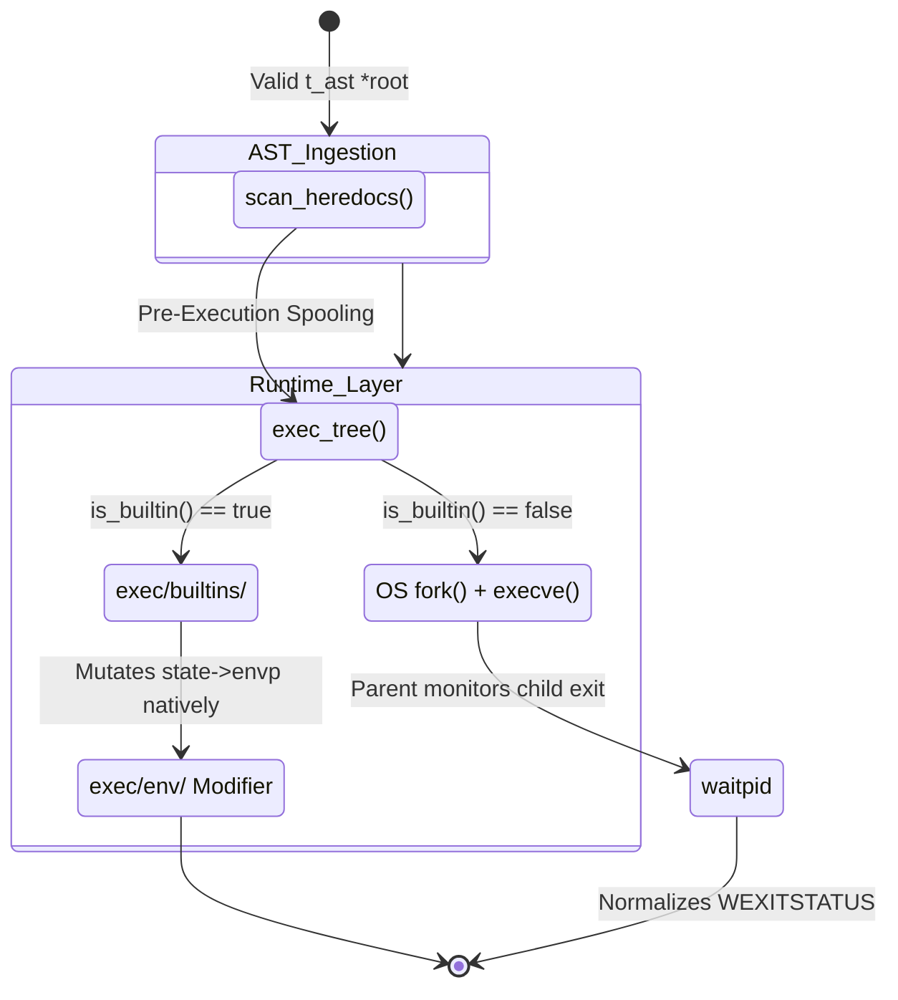

# 🧭 Execution Subsystem (`srcs/exec`)

---

## 🏗️ Architecture TL;DR
> The Execution Subsystem represents the physical "Action Phase" of Minishell. Where the `parsing/` module is strictly analytical and read-only, `exec/` interacts forcefully with the Linux kernel. It spawns child processes (`fork`), manipulates file descriptors (`dup2`), scans the mapped disk for executables (`execve`), and dynamically rewrites the live memory bounds of the shell's active environment matrix.

---

## 🗺️ Data Flow Diagram

---

## 🧱 Subsystems Matrix
| Subsystem | Core Responsibility | Consumes | Produces |
| :--- | :--- | :--- | :--- |
| **`heredoc/`** | Pre-Execution materialization. | `<<` AST Nodes | Physical `/tmp/` files buffering multiline input. |
| **`ast/`** | The execution router. | `t_ast *root` | Triggers OS forks, Pipes, and Logical operators. |
| **`builtins/`** | Internal Command execution. | `char **args` | Mimics specific binaries locally (e.g. `cd`, `export`). |
| **`env/`** | Structural memory shifting. | `envp` Array | Safely re-allocating environment matrices during `unset`/`export`. |

---

## 🧠 Global State Strategy
The `exec` module is the **only subsystem in Minishell** permitted to deeply mutate global state during successful operation:
- Changes to `$PWD` / `$OLDPWD` are physically manifested here.
- `state->exit_code` is consistently overwritten based on `waitpid()` normalizations mapping from `WIFEXITED` limitations into simple integers (0-255).
- Internal variable prefixes natively attached to simple commands (e.g., `VAR=1 ls`) trigger localized duplicates of `state->envp` entirely contained within the execution lifetime of that leaf node.

---

## 🛡️ Error & Signal Philosophy
> [!NOTE]
> **Signal Context Shifting:** The Execution module aggressively alters signal handlers dynamically. When `readline()` is prompting, `SIGINT` creates a new line. When a heredoc is prompting, `SIGINT` aborts the `/tmp/` file. When an external binary is running, `SIGINT` is completely ignored by the parent Minishell and passed entirely to the child `cat`. Each state shift is managed natively during the setup of the respective OS action.
