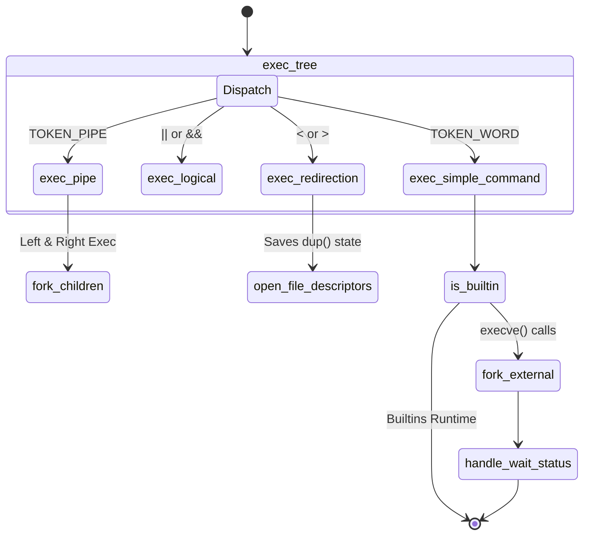

# 📦 AST Execution Engine (`srcs/exec/ast`)

---

## 🚧 Subsystem Boundary
> [!NOTE]
> **Trigger:** Activated strictly by `srcs/core` passing a fully validated `t_ast *root` tree into `exec_tree()`.
> 
> **Output:** Forks processes, manipulates file descriptors, triggers builtins, and ultimately returns a normalized `0-255` exit status to the REPL loop.

---

## ✅ Responsibilities & ❌ Anti-Responsibilities
- **Must:** Recursively traverse nodes (Pipes, Redirections, Logical Operators) resolving left-to-right logic.
- **Must:** Execute the POSIX physical `fork()` mapping for all subshells and external binary calls.
- **Must Not:** Parse syntax natively (Ast is assumed perfectly formed).
- **Must Not:** Expand strings natively (It wraps AST arguments and passes them *back* to `parsing/env/expand` dynamically).

---

## 🔄 Internal Sequence Diagram

---

## 💾 Memory Contracts (Critical)
| Function Allocates | Freeing Responsibility | Condition |
| :--- | :--- | :--- |
| `exec_tree()` | **Read-Only Engine** | Traverses memory created by `parsing/ast`. It NEVER frees the AST itself; it only frees dynamic argument matrices created by the sub-call `expand_tokens()` prior to execution. |

---

## 🧬 State Mutation Matrix
| Scenario | Mutated Field | Assigned Value |
| :--- | :--- | :--- |
| `waitpid()` normalizes child exit | `state->exit_code` | `0-255` (Mapped natively via `WEXITSTATUS` / `WTERMSIG`) |
| `exec_logical()` detects False | None | Blocks the Right tree entirely. |

---

## 🗂️ Files Inventory
| Subpackage/File | Primary Function | Role |
| :--- | :--- | :--- |
| `dispatcher.c` | `exec_tree()` | The recursive router decoding `node->type`. |
| `error.c` | `handle_exec_error()` | Translates `errno` (like `ENOENT`) into `127` mapping. |
| **`exec/`** | `exec_pipe()`, etc. | Subpackage holding the distinct C execution drivers for each node type. |
