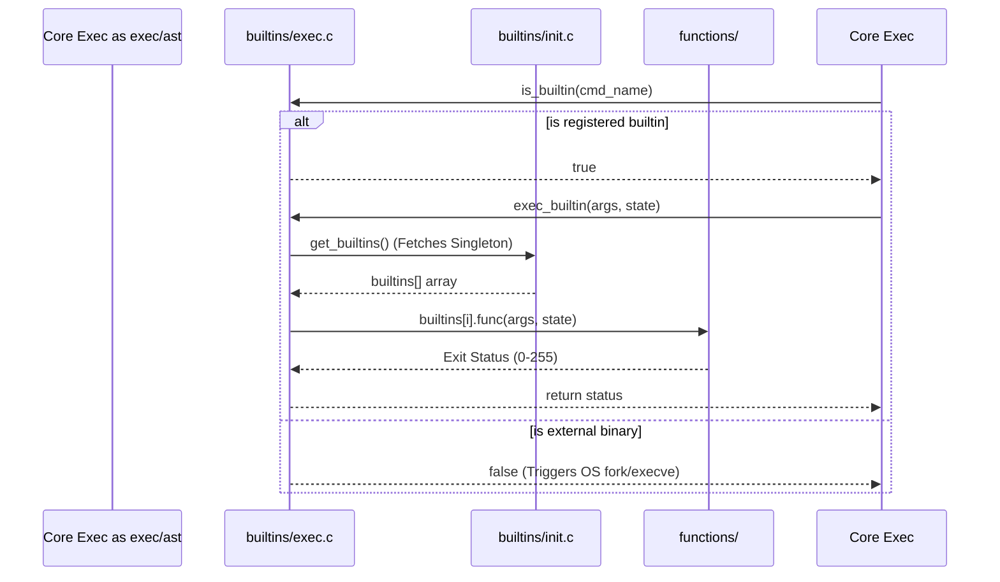

# 📦 Builtins Dispatch System (`srcs/exec/builtins`)

---

## 🚧 Subsystem Boundary
> [!NOTE]
> **Trigger:** Activated inside `exec_tree()` when evaluating a simple command node. Before `fork()`, `is_builtin()` is polled.
> 
> **Output:** Executes the registered C-function matching the command (e.g. `cd`, `echo`) directly within the parent shell memory space, bypassing OS-level `execve` boundaries.

---

## ✅ Responsibilities & ❌ Anti-Responsibilities
- **Must:** Intercept specific bash commands that require mutation of the parent shell environment (`cd`, `export`, `unset`, `exit`).
- **Must:** Host the static function pointer registry mapping `char *names` to `int (*func)()` execution blocks.
- **Must:** Execute identical behavior to POSIX external binaries for overlap commands like `echo` or `pwd`.
- **Must Not:** Handle explicit OS-level forks manually (delegated to `exec/ast`).

---

## 🔄 Internal Sequence Diagram

---

## 💾 Memory Contracts (Critical)
| Function Allocates | Freeing Responsibility | Condition |
| :--- | :--- | :--- |
| `get_builtins()` | **OS Kernel (Static Data)** | Initializes a static array of function pointers. It is NEVER freed dynamically during runtime. |

---

## 🧬 State Mutation Matrix
| Scenario | Mutated Field | Assigned Value |
| :--- | :--- | :--- |
| Handled natively by builtins | `state->envp`, `state->exit_code` | Dynamically adjusted by `export`, `cd`, or `exit`. |

---

## 🗂️ Files Inventory
| File | Primary Function | Role |
| :--- | :--- | :--- |
| `init.c` | `get_builtins()` | Populates and serves the static singleton Function Pointer dictionary. |
| `exec.c` | `exec_builtin()` | Iterates the dictionary comparing strings to execute the internal payload. |
| **`functions/`** | `ft_cd()`, `ft_echo()`, etc. | Subpackage containing the disparate logic for every distinct shell builtin. |