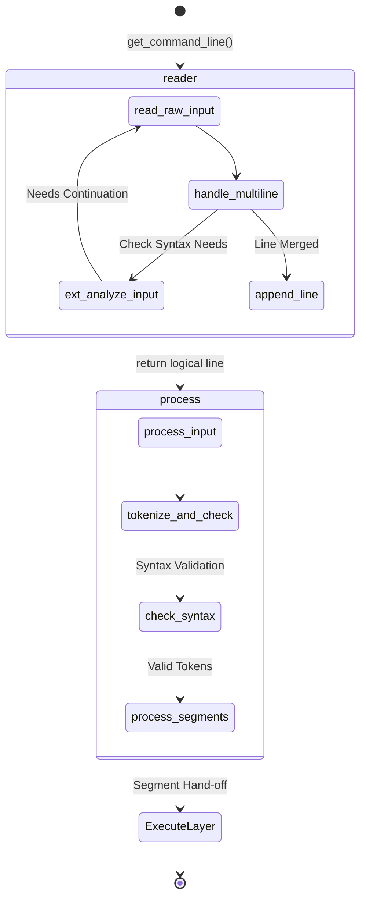

# 🧭 Input Module (`srcs/input`)

---

## 🏗️ Architecture TL;DR
> The Input module is the sole gateway for external command text. It is responsible for acquiring physical text lines (interactive or piped), detecting continuation requirements (unmatched delimiters/operators), merging lines, and validating top-level syntax *before* the AST is built or the execution layer is invoked. It operates as a strict pipeline: **Acquisition -> Continuation Merge -> Tokenization -> Syntax Validation -> Segmentation.**

---

## 🗺️ Data Flow Diagram

---

## 🧱 Subsystems Matrix
| Subsystem | Core Responsibility | Consumes | Produces |
| :--- | :--- | :--- | :--- |
| **`reader/`** | Physical line acquisition & continuation merging. | `stdin` or `readline`. | A single complete logical `char *` line. |
| **`process/`** | Tokenization, Syntax Validation, and Semicolon Segmentation. | A complete `char *` line. | Segmented `t_nodes *` token lists ready for AST. |
| **`reader/extenders/`** | Continuation syntax analysis (unmatched quotes/parens). | `char *` buffer segments. | Continuation codes indicating missing counterparts. |

---

## 🧠 Global State Strategy
The `t_shell_state` pointer is passed explicitly to the entry points (`get_command_line` and `process_input`).
- **Mutation Sandbox:** The `input` module *mutates* `state->exit_code` and `state->syntax_error` directly upon detecting tokenization/syntax errors.
- **Handoff:** Before returning to `core`, `process` writes the execution outcome of each segment back to `state->exit_code`.

---

## 🛡️ Error & Signal Philosophy
> [!NOTE]
> **SIGINT (130):** Handled passively. If `g_last_signal == 130` triggers during `readline`, the `reader` safely aborts and frees the buffer.

> [!CAUTION]
> **Syntax Failure:** Always pre-consumes pending heredocs to mimic bash behavior, then clears token allocations safely via `del_token()`.
