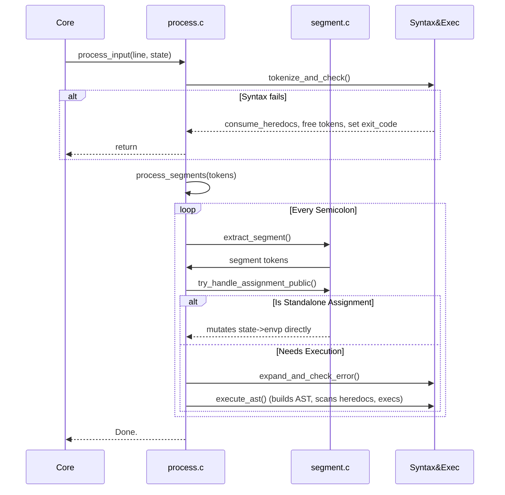

# 📦 Input Process Subsystem (`srcs/input/process`)

---

## 🚧 Subsystem Boundary
> [!NOTE]
> **Trigger:** Activated directly by `core` after receiving a logical text line from `reader`.
> 
> **Output:** Mutates `state->exit_code` based on the execution result of the parsed segments and safely executes or applies assignment shortcuts.

---

## ✅ Responsibilities & ❌ Anti-Responsibilities
- **Must:** Tokenize raw strings into `t_nodes`.
- **Must:** Perform bash POSIX syntax validation *before* extracting segments.
- **Must:** Identify standalone `KEY=VALUE` segments and apply them directly, bypassing the AST.
- **Must Not:** Perform AST node execution itself (delegated to `exec/ast`).
- **Must Not:** Perform line-continuation merges (delegated to `reader/`).

---

## 🔄 Internal Sequence Diagram

---

## 💾 Memory Contracts (Critical)
| Function Allocates | Freeing Responsibility | Condition |
| :--- | :--- | :--- |
| `tokenizer(line)` | `tokenizer` / `process.c` | Returns heap `t_nodes*`. If `check_syntax` fails, `process.c` calls `del_token()`. |
| `build_segment_until_semicolon()` | `process.c` | Detaches a linked list segment from main stream. After processing, `process.c` MUST free it natively via `del_token()`. |
| `ast_builder(segment)` | `execute_ast()` | Translates tokens into `t_ast*`. Must be freed by `free_ast(ast)` directly after `exec_tree`. |

---

## 🧬 State Mutation Matrix
| Scenario | Mutated Field | Assigned Value |
| :--- | :--- | :--- |
| Tokenization syntax rules fail | `state->exit_code` | `2` |
| Heredoc cancellation (SIGINT) | `state->exit_code` | `130` (inherited from signal logic) |
| Successful Executed Segment | `state->exit_code` | Extracted from `sys/wait` status |

---

## 🗂️ Files Inventory
| File | Primary Function | Role |
| :--- | :--- | :--- |
| `process.c` | `process_input()` | Orchestrates the tokenization, validation, and segment splitting loop. |
| `exec.c` | `execute_ast()` | AST translation layer that triggers execution bindings. |
| `segment.c` | `try_handle_assignment_public()` | Identifies and processes pure variable assignment shortcuts. |
| `utils.c` | `consume_semicolon_if_present()` | Utility functions for string validation and node detachment. |