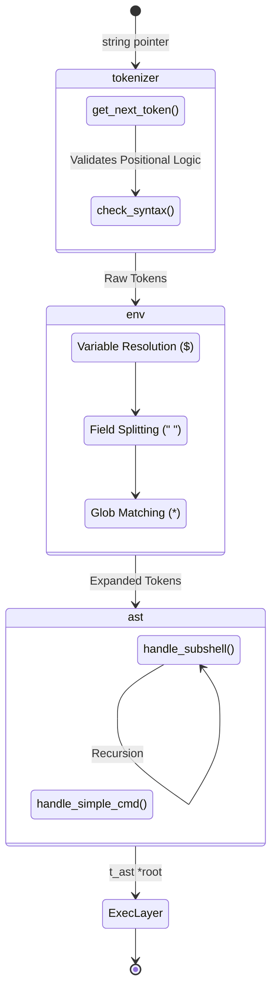

# 🧭 Parsing Module (`srcs/parsing`)

---

## 🏗️ Architecture TL;DR
> The Parsing module is the core intelligence of the shell. It receives physical character strings from `input/`, fractures them into recognized POSIX tokens, resolves all macro `$`/glob `*` expansions natively, and compiles a recursive Abstract Syntax Tree (AST) ready for execution. It aggressively guards the execution pipeline against syntactical and logical errors before any system fork occurs.

---

## 🗺️ Data Flow Diagram

---

## 🧱 Subsystems Matrix
| Subsystem | Core Responsibility | Consumes | Produces |
| :--- | :--- | :--- | :--- |
| **`tokenizer/`** | Character peeling & Punctuation classification. | `char *line` | Linked list of `t_nodes *tokens`. |
| **`env/`** | Macro expansion (`$`, `~`) & Field Splitting. | `t_nodes *tokens` | Fully evaluated, space-fragmented new tokens. |
| **`wildcard/`** | Directory scans and Glob string matching (`*`). | `char *token_value` | Ordered `t_nodes` representing filesystem hits. |
| **`ast/`** | Pipeline and Subshell compilation. | `t_nodes *tokens` | `t_ast *root` mapped to execution structs. |
| **`utils/`** | Safely transitioning lists to `char **` arrays. | `t_nodes *` | Raw standard memory bindings. |

---

## 🧠 Global State Strategy
The Parsing layer treats the shell as **Read-Only** with one strict exception:
- It borrows `state->envp` strictly for lookup arrays during `$VAR` expansion.
- If it encounters a failure (like Unbalanced Quotes or Ambiguous Redirects), it mutates `state->syntax_error` or `state->exit_code` implicitly, allowing the `core` engine to intercept the failure and halt execution early.

---

## 🛡️ Error & Signal Philosophy
> [!NOTE]
> **Crash Early, Free Aggressively:** The parser operates under a strict "fail-fast" policy. If `tokenizer` fails, `env` never runs. If `env` fails, `ast` is never built. Each subpackage guarantees a clean memory rollback (`del_token`, `free_ast`) before returning `NULL` back down the chain.
