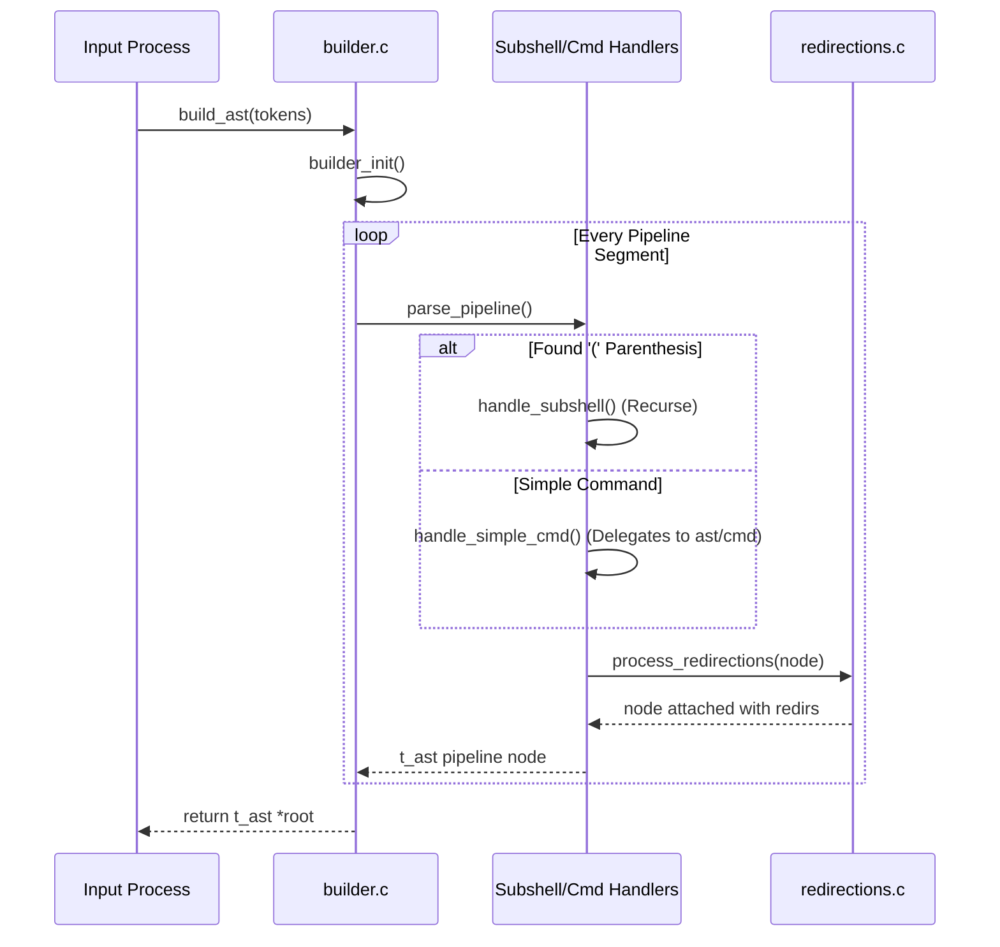

# 📦 Abstract Syntax Tree (AST) Subsystem (`srcs/parsing/ast`)

---

## 🚧 Subsystem Boundary
> [!NOTE]
> **Trigger:** Activated by `input/process` after raw tokens have survived fundamental syntax validation and macro expansion.
> 
> **Output:** Transforms a linear linked list of `t_nodes *tokens` into a robust, recursively executable `t_ast *root` node (which handles pipelines, redirections, and subshells).

---

## ✅ Responsibilities & ❌ Anti-Responsibilities
- **Must:** Iteratively collapse `TOKEN_PIPE` separated tokens into a pipeline AST structure.
- **Must:** Correctly parse parenthesized subshells `()` via recursion.
- **Must:** Aggregate redirection operators (`>`, `<`, `>>`, `<<`) and bind them to the executing node context.
- **Must Not:** Expand shell variables or wildcards (delegated to earlier parsing stages).
- **Must Not:** Execute the generated AST directly (delegated strictly to `exec/`).

---

## 🔄 Internal Sequence Diagram

---

## 💾 Memory Contracts (Critical)
| Function Allocates | Freeing Responsibility | Condition |
| :--- | :--- | :--- |
| **`create_node()`** | `free_ast()` | Generic allocator for all AST variants (Commands, Pipelines, Subshells). The caller (`execute_ast`) MUST call `free_ast` when execution terminates. |
| **`handle_simple_cmd()`** | `free_ast()` | Delegates inner array (`argv` and `assigns`) allocation to `ast/cmd/collect.c`. If any step fails, it self-cleans before returning `NULL`. |

---

## 🧬 State Mutation Matrix
| Scenario | Mutated Field | Assigned Value |
| :--- | :--- | :--- |
| Missing Closing Parentheses `)` in Subshell | `state->syntax_error` | `true` |
| Ambiguous Redirection Target (e.g. empty variable) | `state->syntax_error` | `true` |

---

## 🗂️ Files Inventory
| File | Primary Function | Role |
| :--- | :--- | :--- |
| `builder.c` | `build_ast()` | Main orchestrator dividing tokens into pipelines. |
| `subshell.c` | `handle_subshell()` | Manages deep recursion for parenthesized `()` expressions. |
| `redirections.c` | `process_redirections()` | Extracts redirection operators and attaches target metadata to nodes. |
| `utils.c` | `create_node()` | Heap allocation and recursive `free` management. |
| **`cmd/`** | `handle_simple_cmd()` | Subpackage devoted specifically to extracting standard commands. |
