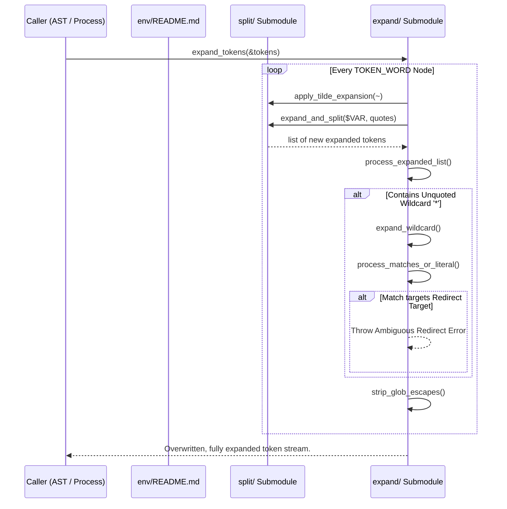

# 📦 Env Expansion Subsystem (`srcs/parsing/env`)

---

## 🚧 Subsystem Boundary
> [!NOTE]
> **Trigger:** Activated by the parser before AST compilation, acting upon a linked list of raw `t_nodes *tokens`.
> 
> **Output:** Unconditionally rewrites the entire token stream. Expands `~`, `$VAR`, splits unquoted values into multiple tokens, and evaluates glob patterns `*`.

---

## ✅ Responsibilities & ❌ Anti-Responsibilities
- **Must:** Resolve all valid `$`, `~`, and `*` shell macros.
- **Must:** Split unquoted expansions into independent `t_nodes` (Field Splitting).
- **Must:** Strip internal structural quotes (`'` and `"`) after their protective role is over.
- **Must Not:** Compile the tokens into execution structures (delegated to `ast/`).
- **Must Not:** Evaluate non-word tokens like `|`, `<`, or `>`.

---

## 🔄 Internal Sequence Diagram

---

## 💾 Memory Contracts (Critical)
| Function Allocates | Freeing Responsibility | Condition |
| :--- | :--- | :--- |
| `expand_and_split()` | `expand_tokens()` | Allocates a fresh sequence of `t_nodes` based on string splitting. Caller iterates, extracts, and incorporates them into the main list, eventually freeing intermediate structs. |
| `expand_tokens()` | **Original token cleanup** | Iterates the incoming list. It MUST free original unexpanded `t_nodes` natively when substituting them with the newly expanded sequences. |

---

## 🧬 State Mutation Matrix
| Scenario | Mutated Field | Assigned Value |
| :--- | :--- | :--- |
| Variable Expansion | Searches `state->envp` | **None directly**. Pulls values but does not modify the shell environment array. |
| Expansion Error (Ambiguous Redirect) | `expansion_error` flag internally | `1`. The caller sets `state->exit_code = 1` upstream. |

---

## 🗂️ Files Inventory
| Subpackage | Primary Function | Role |
| :--- | :--- | :--- |
| `expand/` | `expand_tokens()` | Manages the list-level traversal, wildcard pattern matching, and Ambiguous Redirect detection. |
| `split/` | `expand_and_split()` | The string-level engine. Handles `$`, quotes, `~`, and space-based Field Splitting. |
