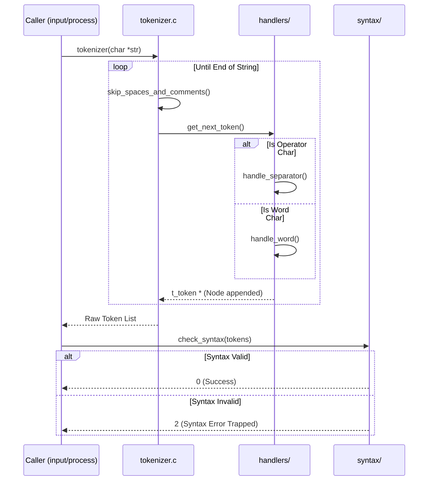

# 📦 Tokenizer Subsystem (`srcs/parsing/tokenizer`)

---

## 🚧 Subsystem Boundary
> [!NOTE]
> **Trigger:** Activated by `input/process` receiving a raw, complete logical text string from the reader.
> 
> **Output:** Converts the raw character array into a sequentially validated, heap-allocated linked list of `t_nodes *tokens`.

---

## ✅ Responsibilities & ❌ Anti-Responsibilities
- **Must:** Skim comments (`#`) and unquoted whitespace securely.
- **Must:** Distinguish structural operators (`|`, `&&`, `>`, etc.) from literal command words.
- **Must:** Run a strict **Syntax Validation Pass** on the extracted nodes before handing them back to the caller.
- **Must Not:** Expand `$VARIABLES` or `*` wildcards (delegated to `parsing/env`).
- **Must Not:** Handle line-continuation logic (delegated strictly to `input/reader`).

---

## 🔄 Internal Sequence Diagram

---

## 💾 Memory Contracts (Critical)
| Function Allocates | Freeing Responsibility | Condition |
| :--- | :--- | :--- |
| **`get_next_token()`** | `tokenizer()` / Upstream | Allocates individual `t_token` structs and distinct `char *value` slices. If `get_next_token` internally fails (e.g. unclosed quote), it frees itself and returns `NULL`. |
| **`tokenizer()`** | `tokenizer()` / Upstream | Wraps `t_token` data inside `t_nodes` linked lists. If an allocation fails mid-loop, it immediately loops backwards freeing all accumulated nodes via `del_token` before returning `NULL`. |

---

## 🧬 State Mutation Matrix
| Scenario | Mutated Field | Assigned Value |
| :--- | :--- | :--- |
| `check_syntax()` Identifies Sequential Error | `state->exit_code` (Handled by upstream wrapper) | `2` |
| Successful Tokenization | **None** | Pure data transformation; does not touch global state natively. |

---

## 🗂️ Files Inventory
| Subpackage | Primary Function | Role |
| :--- | :--- | :--- |
| `tokenizer.c` | `tokenizer()` | The high-level loop iteratively peeling strings into node blocks. |
| `handlers/` | `get_next_token()` | Subpackage devoted to classifying characters into discrete token chunks. |
| `syntax/` | `check_syntax()` | Subpackage enforcing Bash positional token rules (e.g. tracking `| |`). |