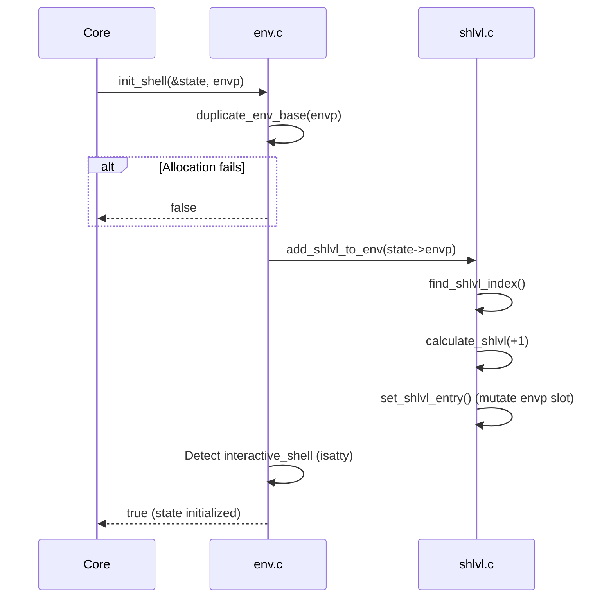

# 📦 State & Environment Subsystem (`srcs/state`)

---

## 🚧 Subsystem Boundary
> [!NOTE]
> **Trigger:** Activated once during `core/minishell.c` startup (for environment duplication) and repeatedly by `exec` or `input` when swapping signal modes.
> 
> **Output:** Mutates `t_shell_state`, owns the heap-allocated duplicate of `envp`, and manipulates the kernel's process signal disposition.

---

## ✅ Responsibilities & ❌ Anti-Responsibilities
- **Must:** Perform deep copies of the parent process's `envp` array into the heap.
- **Must:** Normalize and increment the `SHLVL` environment variable during boot.
- **Must:** Provide centralized APIs for switching signal handlers based on execution context (e.g., Prompt vs Blocking).
- **Must Not:** Parse input tokens or modify execution workflows.
- **Must Not:** Free its own `envp` matrix (delegated exclusively back to `core/` at shutdown).

---

## 🔄 Internal Sequence Diagram

---

## 💾 Memory Contracts (Critical)
| Function Allocates | Freeing Responsibility | Condition |
| :--- | :--- | :--- |
| `duplicate_env_base()` | `core/minishell.c` (`cleanup_envp`) | Allocates the entire 2D `char **` array. If an inner `strdup` fails, it self-cleans and returns `NULL`. |
| `make_shlvl_str()` | `add_shlvl_to_env()` / `cleanup_envp` | Creates `"SHLVL=X"`. If an old slot exists, `add_shlvl` frees the old string and inserts the new one. At exit, `cleanup_envp` frees it. |
| `ft_get_env()` | **No Allocation** | Returns a borrowed pointer pointing deep inside an existing `envp` string. Callers MUST NOT free it. |

---

## 🧬 State Mutation Matrix
| Scenario | Mutated Field | Assigned Value |
| :--- | :--- | :--- |
| `init_shell()` invoked successfully | `state->envp` | Heap pointer to deep-copied environment array. |
| Standard boot via TTY | `state->interactive_shell` | `true` if both `STDIN` and `STDERR` satisfy `isatty()`. |
| Initializing shell fields | `state->exit_code`, `syntax_error`, `expansion_error` | `0` or `false`. |

---

## 🗂️ Files Inventory
| File | Primary Function | Role |
| :--- | :--- | :--- |
| `env.c` | `init_shell()` | Deep copies environment and instantiates the `t_shell_state` baseline. |
| `shlvl.c` | `add_shlvl_to_env()` | Enforces POSIX-compliant shell level incrementation logic. |
| `signals/` | `setup_signals()` | Subpackage handling all `sigaction` modifications and interrupt loops. |