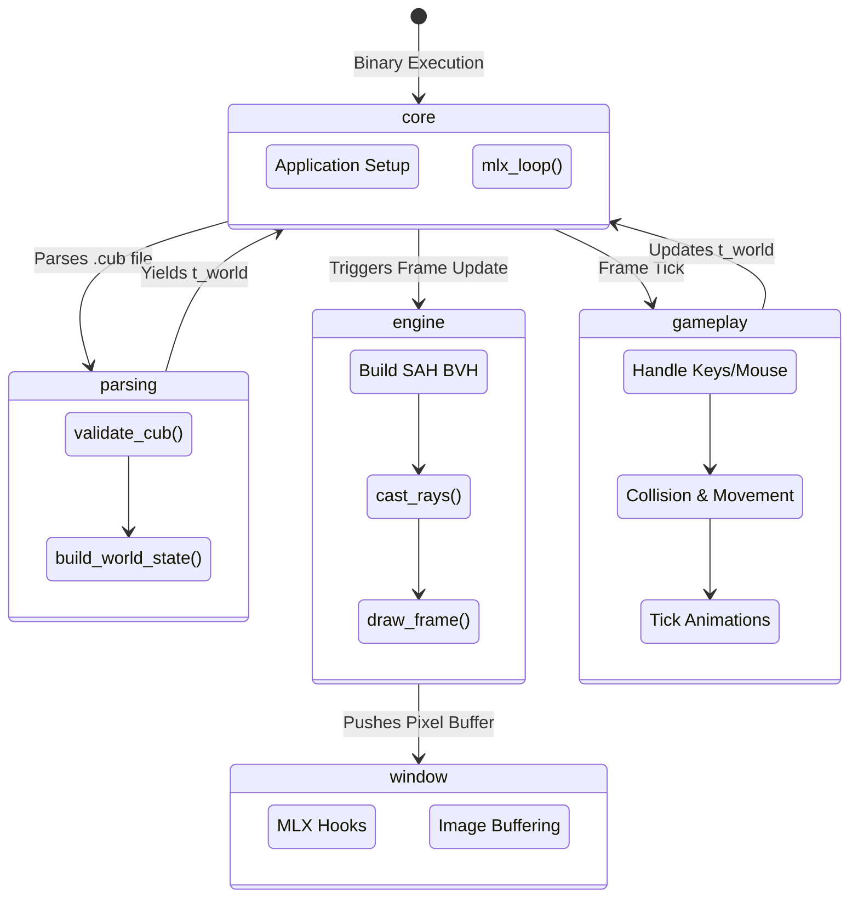

# 🏰 **Cub3D** - *A high-performance raycasting engine*

> **A 42 cub3D implementation in C.**  
> This project is a tribute to the early 90s FPS pioneers like Wolfenstein 3D. It implements a custom raycasting engine from scratch, utilizing advanced spatial partitioning (SAH BVH) for optimized rendering, multi-threaded-ready design, and a modular architecture to handle textures, sprites, and complex game logic within the strict constraints of the C language and the MinilibX library.


---

## ✨ **Core Features**

- **Pseudo-3D Raycasting Engine**: Real-time rendering of a 2D map into a 3D perspective.
- **Advanced Optimization**: Implements **Surface Area Heuristic (SAH) Bounding Volume Hierarchies (BVH)** for ultra-fast ray-world intersections.
- **Textured Environment**: Per-wall texture mapping (North, South, East, West) with precise UV calculation.
- **Dynamic Gameplay**: Smooth movement, rotation, and interaction system (doors, switches).
- **Minimap Overlay**: Real-time top-down navigation with player orientation.
- **Collision Physics**: Robust wall and object collision detection for smooth navigation.
- **Sprite Animation System**: Support for animated entities and transparent XPM sprites.
- **Robust Parsing**: Strict `.cub` file validation with error reporting for map geometry and configuration.

---

## 🗺️ **Global Pipeline & Data Flow**

At a high level, the engine runs this exact pipeline:
`startup -> map parsing -> MLX initialization -> world generation -> game loop (tick -> render) -> cleanup`

The architecture relies on a clear separation between the math primitives, the rendering engine, and the windowing system:



---

## 🧱 **Subsystems Matrix**
| Subsystem Folder | Core Responsibility | Consumes | Produces |
| :--- | :--- | :--- | :--- |
| **`srcs/core/`** | Application Lifecycle | `.cub` file path | Orchestrates init and main loop. |
| **`srcs/window/`** | Graphics & Events | Screen Buffers | Window display and user inputs. |
| **`srcs/engine/`** | Rendering Logic | `t_world` / BVH | Ray-traced visual columns. |
| **`srcs/gameplay/`** | Game Logic | Input events | State updates (Player/Sprites). |
| **`srcs/primitives/`** | Data Structures | Raw data | Maps, Textures, and Vectors. |
| **`srcs/helpers/`** | Utilities | Generic requests | Math results, errors, and cleanup. |

---

## 🧠 **Global State Strategy**
Cub3D relies on a hierarchical state management system centered around three primary structures:
- **`t_window`**: Manages the MinilibX instance, window pointer, and the active pixel buffer.
- **`t_world`**: Stores the map geometry, player state, and the BVH for collision/rendering.
- **`t_app`**: The top-level "God Object" that links the window and world together, passed to MLX hooks.

---

## 🛡️ **Memory & Safety Philosophy**
> [!IMPORTANT]
> **Unified Exit Path:** All errors or exits are channeled through `safe_exit()`. This ensures that MLX pointers, textures, map data, and BVH nodes are recursively freed regardless of where the failure occurred.

> [!CAUTION]
> **Resource Management:** Every texture loaded and every BVH node allocated is tracked. The project adheres to strict "No Leak" policies, even in the event of malformed map files or initialization failures.

---

## 🗂️ **Project Layout & Documentation Mapping**

For deep-dive technical documentation on the specific math and optimization techniques used:

- [srcs/README.md](srcs/README.md) — High-level Subsystem Map.
- [srcs/engine/README.md](srcs/engine/README.md) — Raycasting & BVH details.
- [srcs/gameplay/README.md](srcs/gameplay/README.md) — Movement & Collision laws.
- [srcs/window/README.md](srcs/window/README.md) — MLX Event handling.
- [srcs/core/README.md](srcs/core/README.md) — Lifecycle & Initialization.

---

## ⚙️ **Build**

Prerequisites:
- `cc`, `make`, and `MinilibX` dependencies (X11, etc).

Build from the repository root:
```bash
make
```

**Useful targets:**
- `make` — build `cub3D`
- `make clean` — remove object files
- `make fclean` — remove object files and the executable
- `make re` — full rebuild

---

## ▶️ **Run**

Launch the engine with a valid configuration file:
```bash
./cub3D maps/test.cub
```

---

## 🔬 **Testing**

You can test map validation using the provided maps in the `maps/` directory:

```bash
# Test valid map
./cub3D maps/valid.cub

# Test invalid map (should report error and exit gracefully)
./cub3D maps/invalid_no_wall.cub
```

For memory checking:
```bash
valgrind --leak-check=full --show-leak-kinds=all ./cub3D maps/test.cub
```

---

## 🛠️ **Development Notes & Next Steps**

- **Math Precision**: Vectors use `double` for high-precision ray intersections.
- **Norm Compliance**: Code follows strict 42 Norm standards.
- **Performance**: The SAH BVH allows for much larger and more complex maps than standard DDA-only implementations.
- **Future Upgrades**: Potential for floor/ceiling textures, skyboxes, and more complex entity AI.
