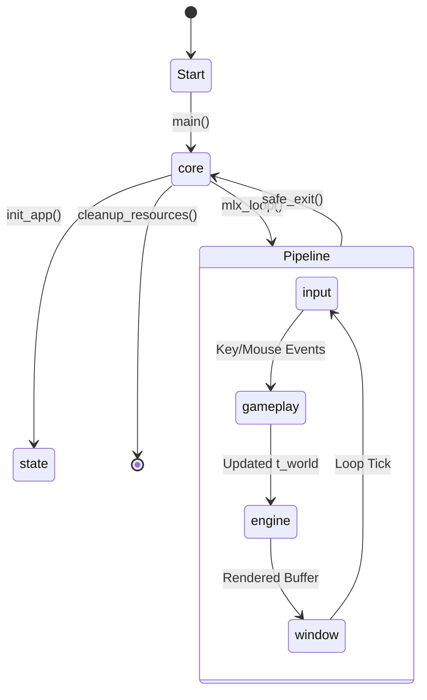

# Cub3D Engine Pipeline (`srcs/`)

## Architecture TL;DR
The `srcs/` directory implements a high-performance **Pseudo-3D Raycasting Engine**. The application follows a strictly modular architecture where the core loop orchestrates distinct layers: the **Windowing Layer** (MLX interface), the **Physics & Gameplay Layer** (state updates), and the **Rendering Engine** (BVH-accelerated raycasting). State is centralized in `t_app` and `t_world` structures to ensure thread-safety and modularity.

## Data Flow Diagram

## Subsystems Matrix
| Subsystem | Core Responsibility | Consumes | Produces |
| :--- | :--- | :--- | :--- |
| `core/` | App entry and main loop orchestration. | Command line ARGV | Application lifecycle and `t_app` state. |
| `window/` | MLX management, pixel buffering, events. | Raw pixel data | On-screen frames and event hooks. |
| `engine/` | Raycasting, BVH traversal, texture mapping. | `t_world` / Map | Rendered image buffers. |
| `gameplay/` | Movement, collision, and game logic. | Input events | Mutated `t_player` and `t_sprite` state. |
| `primitives/` | Low-level math and data structures. | Vectors / Rays | Mathematical intersections and map data. |
| `helpers/` | Math utilities and error management. | Utility calls | Validated results and safe teardowns. |

## Global State Strategy
State ownership is strictly partitioned:
- The `t_app` structure acts as the global context for the MLX loop.
- **`t_world`** owns the heap-allocated map and the SAH BVH, which is built once during initialization and used for every frame's intersection tests.
- Memory is managed through a "unified teardown" approach in `safe_exit()`, ensuring all textures and BVH nodes are released regardless of the exit condition.

## Error & Exit Philosophy
- Any fatal error (MLX failure, malformed map, memory exhaustion) triggers `safe_exit()`.
- The engine uses a "clean failure" model: partial initializations are always rolled back to prevent resource leaks during startup failures.