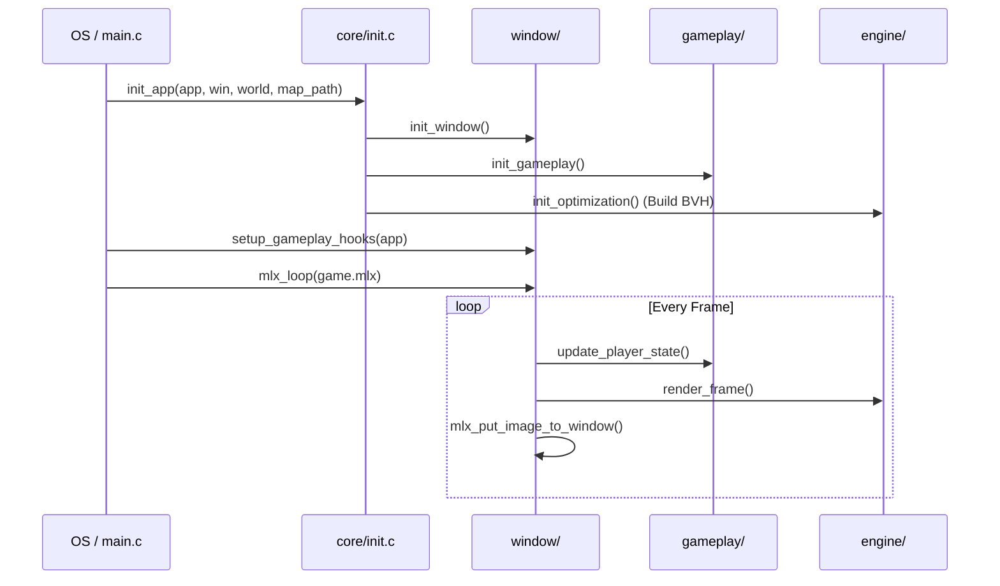

# 📦 Core Module Subsystem (`srcs/core`)

---

## 🚧 Subsystem Boundary
> [!NOTE]
> **Trigger:** Activated directly by the OS binary loader (`main`) with `argc` and `argv`.
> 
> **Output:** Orchestrates the initialization of the graphics window and the game world, then hands control to the `mlx_loop`.

---

## ✅ Responsibilities & ❌ Anti-Responsibilities
- **Must:** Bootstrap the `t_app` state through `init_app`.
- **Must:** Validate command line arguments (map file extension and existence).
- **Must:** Initialize the MinilibX instance and create the primary window.
- **Must:** Setup MLX hooks for keyboard, mouse, and frame updates.
- **Must Not:** Handle raycasting math directly (delegated to `engine/`).
- **Must Not:** Perform complex map parsing (delegated to `helpers/parser.c` and `primitives/map.c`).

---

## 🔄 Internal Sequence Diagram

---

## 💾 Memory Contracts (Critical)
| Function Allocates | Freeing Responsibility | Condition |
| :--- | :--- | :--- |
| `init_app()` | `safe_exit()` | Allocates textures, map arrays, and BVH nodes. All must be freed during exit. |
| `mlx_init()` | `mlx_destroy_display()` | Managed via `safe_exit` to ensure no X11 memory leaks. |

---

## 🧬 State Mutation Matrix
| Scenario | Mutated Field | Assigned Value |
| :--- | :--- | :--- |
| Startup | `app->window` | Pointer to initialized `t_window`. |
| Startup | `app->world` | Pointer to initialized `t_world`. |

---

## ⚠️ Edge Cases & Gotchas
> [!CAUTION]
> **MLX Initialization Failure:** If `mlx_init()` or `mlx_new_window()` fails, the system must immediately call `safe_exit()` with an appropriate error message to avoid dangling pointers.

---

## 🗂️ Files Inventory
| File | Primary Function | Role |
| :--- | :--- | :--- |
| `main.c` | `main()` | Application entry point and high-level control flow. |
| `init.c` | `init_app()` | Centralized initialization for all subsystems. |
