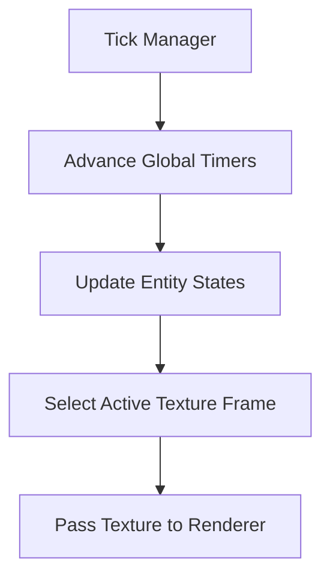

# 🎬 Animation Subsystem (`srcs/engine/animation`)

---

## 🚧 Subsystem Boundary
> [!NOTE]
> **Trigger:** Initialized at startup and updated every frame to drive dynamic visual changes in the world.
> 
> **Output:** Manages the visual state, frame timing, and texture sequences for all animated entities and UI elements.

---

## ✅ Responsibilities & ❌ Anti-Responsibilities
- **Must:** Orchestrate the loading and playback of multi-frame XPM sequences.
- **Must:** Synchronize animation speeds with global delta-time.
- **Must:** Manage visual state transitions (e.g., Idle -> Attack) for entities.
- **Must Not:** Perform the actual raycasting or Z-buffering (delegated to `render/`).
- **Must Not:** Handle physics or collision (delegated to `physics/`).

---

## 🔄 Animation Hub Flow

---

## 🧱 Sub-Modules Matrix
| Module | Role | Documentation |
| :--- | :--- | :--- |
| **`anim/`** | Behavioral State & Logic | [README](anim/README.md) |
| **`render/`** | Sprite Projection & Drawing | [README](render/README.md) |

---

## 🧬 Subsystem Strategy
The animation system operates on a **Decoupled Tick** model:
1.  **State Layer**: Entities (monsters, items) have logical states that dictate which "clip" (sequence of frames) is active.
2.  **Timing Layer**: A high-resolution timer calculates the fractional frame index based on the elapsed delta-time.
3.  **Visual Layer**: The renderer uses the calculated frame index to retrieve the correct texture from the `t_anim_set`.

---

## ⚠️ Edge Cases & Gotchas
> [!IMPORTANT]
> **Memory Usage:** Animation sequences can consume significant VRAM. The subsystem uses a shared texture registry to ensure that multiple instances of the same monster type reuse the same loaded assets.

---

## 🗂️ Files Inventory
| File | Role |
| :--- | :--- |
| `anim/` | Handles timers and state-based clip selection. |
| `render/` | Handles the perspective projection of animated sprites. |
