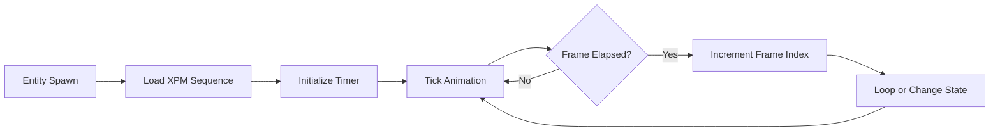
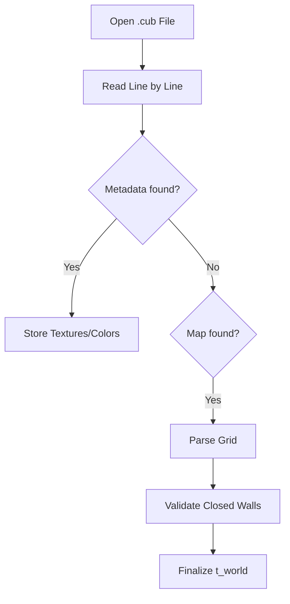

# 🎬 Animation Logic Module (`srcs/engine/animation/anim`)

---

## 🚧 Subsystem Boundary
> [!NOTE]
> **Trigger:** Triggered every frame tick to update the visual state of dynamic world objects.
> 
> **Output:** Updates frame pointers and state flags for all animated entities, consumed by the rendering engine.

---

## ✅ Responsibilities & ❌ Anti-Responsibilities
- **Must:** Manage frame timers and frame-rate independent transitions.
- **Must:** Implement state machines for entity behaviors (Idle, Walk, Attack).
- **Must:** Load and organize animation "clips" from XPM sequences.
- **Must Not:** Perform pixel-level rendering (delegated to `animation/render`).
- **Must Not:** Handle physics or collision (delegated to `physics/`).

---

## 🔄 Animation Lifecycle

---

## 🧬 Animation Logic Matrix
| Feature | Implementation | Notes |
| :--- | :--- | :--- |
| **Clip Management** | `clip.c` | Handles sequences of textures as a single logical unit. |
| **State Machine** | `animstate.c` | Switches between clips based on entity actions. |
| **Manager** | `mgr.c` | Global registry for all active animations in the world. |

---

## ⚠️ Edge Cases & Gotchas
> [!WARNING]
> **Delta-Time Synchronization:** Animation speeds must be multiplied by the frame time to ensure they don't speed up or slow down based on the game's FPS.

---

## 🗂️ Files Inventory
| File | Primary Function | Role |
| :--- | :--- | :--- |
| `mgr.c` | `update_animations()` | Primary update loop for all entities. |
| `clip.c` | `get_current_frame()` | Returns the texture pointer for the active frame. |
| `load.c` | `load_anim_set()` | Batch loads XPMs into animation structures. |
| `animstate.c` | `set_state()` | Triggers transitions between different clips. |

---

## 🚧 Subsystem Boundary
> [!NOTE]
> **Trigger:** Called by all subsystems for specific utility tasks (parsing, math, exit handling).
> 
> **Output:** Provides validated results (like a parsed world state) or performs terminal actions (like printing errors and exiting).

---

## ✅ Responsibilities & ❌ Anti-Responsibilities
- **Must:** Parse and validate the `.cub` configuration file.
- **Must:** Provide high-level math utilities (distance, trigonometry).
- **Must:** Manage the application's "Safe Exit" lifecycle.
- **Must:** Implement generic string and list manipulation helpers.
- **Must Not:** Define core data structures (delegated to `primitives/`).
- **Must Not:** Contain game loop logic (delegated to `core/`).

---

## 🔄 Parsing Pipeline

---

## 💾 Memory Contracts (Critical)
| Function Allocates | Freeing Responsibility | Condition |
| :--- | :--- | :--- |
| `get_next_line()` | `parse_file()` | Temporary strings during parsing must be freed immediately after consumption. |
| `safe_exit()` | **Recursive Teardown** | This function is the ultimate "Memory Garbage Collector" during any exit scenario. |

---

## 🧬 Utility Matrix
| Feature | Implementation | Notes |
| :--- | :--- | :--- |
| **Parsing** | State-machine based | Handles metadata and map data in a single pass. |
| **Error Handling** | Prefix-based reporting | Prints "Error\n" followed by a specific message to `STDERR`. |
| **Math** | Fast lookup tables | (Optional) Can be used for trig functions if performance is critical. |

---

## ⚠️ Edge Cases & Gotchas
> [!CAUTION]
> **Hanging File Descriptors:** If parsing fails midway, the `safe_exit` routine must ensure that any open file descriptors are properly closed to avoid system resource exhaustion.

---

## 🗂️ Files Inventory
| File | Primary Function | Role |
| :--- | :--- | :--- |
| `parser.c` | `parse_cub()` | Orchestrates the translation of text files into world state. |
| `exit.c` | `safe_exit()` | Centralized error reporting and memory cleanup. |
| `maths.c` | `get_dist()` | General math utility library. |
| `debug.c` | `print_world()` | Internal tools for visualizing state during development. |
