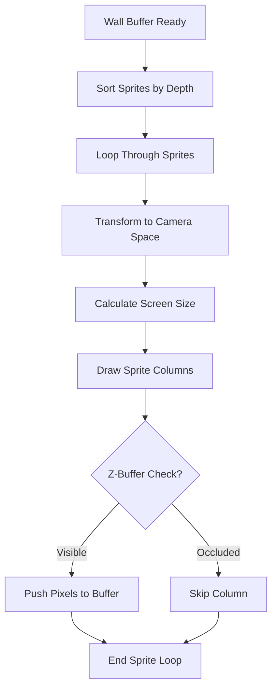
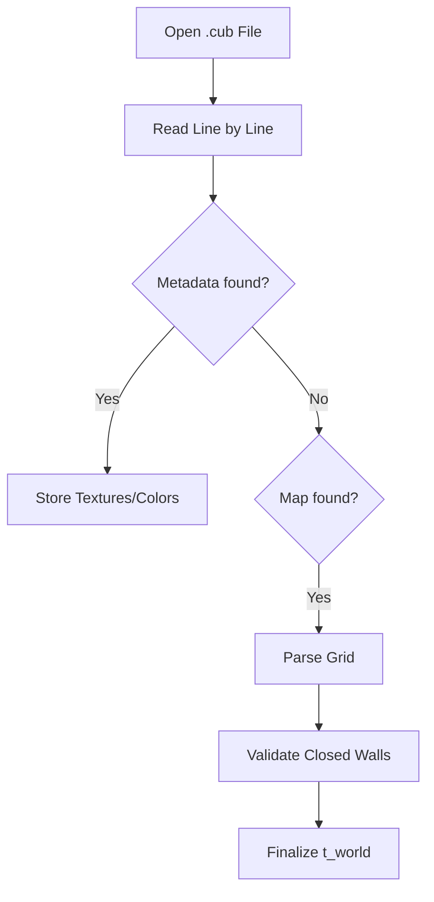

# 🎭 Sprite Rendering Module (`srcs/engine/animation/render`)

---

## 🚧 Subsystem Boundary
> [!NOTE]
> **Trigger:** Called after the wall-rendering phase of the raycasting engine.
> 
> **Output:** Draws transparent entities and sprites onto the screen buffer with correct depth and occlusion.

---

## ✅ Responsibilities & ❌ Anti-Responsibilities
- **Must:** Sort sprites based on Euclidean distance to the player (Painter's Algorithm).
- **Must:** Calculate screen projections and scaling factors for sprite columns.
- **Must:** Implement alpha-blending for transparent XPM colors (e.g., color `0x00FF00` as mask).
- **Must Not:** Handle entity logic or AI (delegated to `animation/anim`).
- **Must Not:** Perform wall raycasting (delegated to `render/`).

---

## 🔄 Sprite Pipeline

---

## 🧬 Rendering Logic Matrix
| Feature | Implementation | Notes |
| :--- | :--- | :--- |
| **Depth Sorting** | `qsort` or Bubble Sort | Ensures far sprites are drawn before near ones. |
| **Occlusion** | Z-Buffer Comparison | Prevents sprites from showing through solid walls. |
| **Scaling** | Perspective Projection | Adjusts sprite size based on 1/Dist. |

---

## ⚠️ Edge Cases & Gotchas
> [!CAUTION]
> **Sprite Clipping:** Sprites partially behind a wall must be clipped on a per-column basis using the Z-buffer populated during the wall-casting phase.

---

## 🗂️ Files Inventory
| File | Primary Function | Role |
| :--- | :--- | :--- |
| `sprite.c` | `render_sprites()` | Orchestrates the depth sorting and drawing loop. |
| `core.c` | `draw_column()` | Low-level pixel pushing for a single sprite strip. |
| `utils.c` | `get_depth()` | Euclidean distance calculations for sorting. |

---

## 🚧 Subsystem Boundary
> [!NOTE]
> **Trigger:** Called by all subsystems for specific utility tasks (parsing, math, exit handling).
> 
> **Output:** Provides validated results (like a parsed world state) or performs terminal actions (like printing errors and exiting).

---

## ✅ Responsibilities & ❌ Anti-Responsibilities
- **Must:** Parse and validate the `.cub` configuration file.
- **Must:** Provide high-level math utilities (distance, trigonometry).
- **Must:** Manage the application's "Safe Exit" lifecycle.
- **Must:** Implement generic string and list manipulation helpers.
- **Must Not:** Define core data structures (delegated to `primitives/`).
- **Must Not:** Contain game loop logic (delegated to `core/`).

---

## 🔄 Parsing Pipeline

---

## 💾 Memory Contracts (Critical)
| Function Allocates | Freeing Responsibility | Condition |
| :--- | :--- | :--- |
| `get_next_line()` | `parse_file()` | Temporary strings during parsing must be freed immediately after consumption. |
| `safe_exit()` | **Recursive Teardown** | This function is the ultimate "Memory Garbage Collector" during any exit scenario. |

---

## 🧬 Utility Matrix
| Feature | Implementation | Notes |
| :--- | :--- | :--- |
| **Parsing** | State-machine based | Handles metadata and map data in a single pass. |
| **Error Handling** | Prefix-based reporting | Prints "Error\n" followed by a specific message to `STDERR`. |
| **Math** | Fast lookup tables | (Optional) Can be used for trig functions if performance is critical. |

---

## ⚠️ Edge Cases & Gotchas
> [!CAUTION]
> **Hanging File Descriptors:** If parsing fails midway, the `safe_exit` routine must ensure that any open file descriptors are properly closed to avoid system resource exhaustion.

---

## 🗂️ Files Inventory
| File | Primary Function | Role |
| :--- | :--- | :--- |
| `parser.c` | `parse_cub()` | Orchestrates the translation of text files into world state. |
| `exit.c` | `safe_exit()` | Centralized error reporting and memory cleanup. |
| `maths.c` | `get_dist()` | General math utility library. |
| `debug.c` | `print_world()` | Internal tools for visualizing state during development. |
