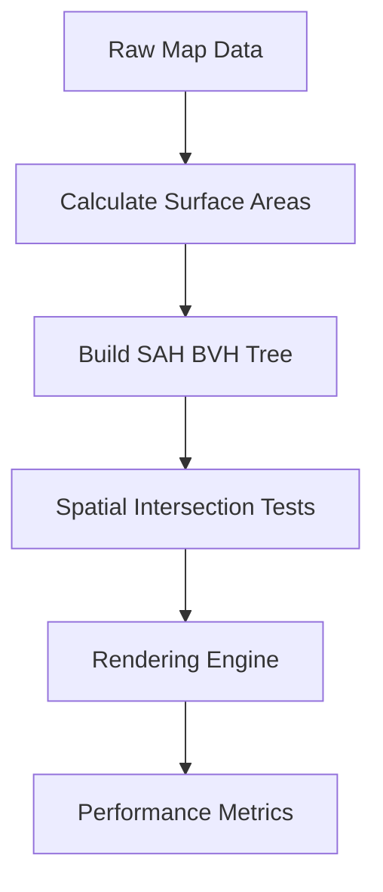
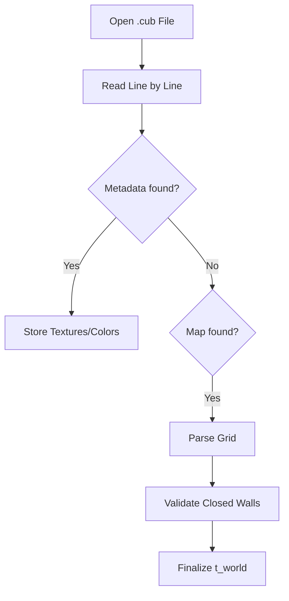

# ⚡ Optimization Subsystem (`srcs/engine/optimization`)

---

## 🚧 Subsystem Boundary
> [!NOTE]
> **Trigger:** Initialized during world generation to build spatial partitioning structures.
> 
> **Output:** Provides high-speed intersection queries and reduces the computational complexity of raycasting.

---

## ✅ Responsibilities & ❌ Anti-Responsibilities
- **Must:** Build and manage the **Surface Area Heuristic (SAH) BVH** for the map.
- **Must:** Implement fast AABB vs Ray intersection tests.
- **Must:** Minimize redundant calculations in the rendering loop.
- **Must Not:** Perform the actual ray-stepping (delegated to `dda/`).
- **Must Not:** Handle texture mapping logic (delegated to `render/`).

---

## 🔄 Optimization Strategy

---

## 🧬 Optimization Matrix
| Feature | Implementation | Performance Impact |
| :--- | :--- | :--- |
| **Spatial Partitioning** | SAH BVH | Reduces ray-world tests from O(N) to O(log N). |
| **Bounds Pruning** | AABB Culling | Skips entire map sections not in the ray path. |
| **Data Locality** | Packed Node Structs | Improves CPU cache hit rates during traversal. |

---

## ⚠️ Edge Cases & Gotchas
> [!CAUTION]
> **BVH Build Time:** For extremely large maps, the SAH builder may introduce a noticeable startup delay. The implementation must balance build depth with runtime traversal speed.

---

## 🗂️ Files Inventory
| File | Primary Function | Role |
| :--- | :--- | :--- |
| `optimization.c` | `init_optimization()` | High-level orchestration of performance modules. |

---

## 🚧 Subsystem Boundary
> [!NOTE]
> **Trigger:** Called by all subsystems for specific utility tasks (parsing, math, exit handling).
> 
> **Output:** Provides validated results (like a parsed world state) or performs terminal actions (like printing errors and exiting).

---

## ✅ Responsibilities & ❌ Anti-Responsibilities
- **Must:** Parse and validate the `.cub` configuration file.
- **Must:** Provide high-level math utilities (distance, trigonometry).
- **Must:** Manage the application's "Safe Exit" lifecycle.
- **Must:** Implement generic string and list manipulation helpers.
- **Must Not:** Define core data structures (delegated to `primitives/`).
- **Must Not:** Contain game loop logic (delegated to `core/`).

---

## 🔄 Parsing Pipeline

---

## 💾 Memory Contracts (Critical)
| Function Allocates | Freeing Responsibility | Condition |
| :--- | :--- | :--- |
| `get_next_line()` | `parse_file()` | Temporary strings during parsing must be freed immediately after consumption. |
| `safe_exit()` | **Recursive Teardown** | This function is the ultimate "Memory Garbage Collector" during any exit scenario. |

---

## 🧬 Utility Matrix
| Feature | Implementation | Notes |
| :--- | :--- | :--- |
| **Parsing** | State-machine based | Handles metadata and map data in a single pass. |
| **Error Handling** | Prefix-based reporting | Prints "Error\n" followed by a specific message to `STDERR`. |
| **Math** | Fast lookup tables | (Optional) Can be used for trig functions if performance is critical. |

---

## ⚠️ Edge Cases & Gotchas
> [!CAUTION]
> **Hanging File Descriptors:** If parsing fails midway, the `safe_exit` routine must ensure that any open file descriptors are properly closed to avoid system resource exhaustion.

---

## 🗂️ Files Inventory
| File | Primary Function | Role |
| :--- | :--- | :--- |
| `parser.c` | `parse_cub()` | Orchestrates the translation of text files into world state. |
| `exit.c` | `safe_exit()` | Centralized error reporting and memory cleanup. |
| `maths.c` | `get_dist()` | General math utility library. |
| `debug.c` | `print_world()` | Internal tools for visualizing state during development. |
