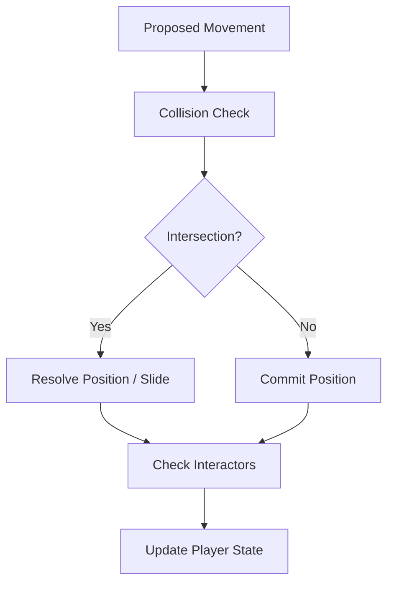

# ⚙️ Physics Engine Subsystem (`srcs/engine/physics`)

---

## 🚧 Subsystem Boundary
> [!NOTE]
> **Trigger:** Called every frame during the gameplay tick to update entity positions based on velocity and input.
> 
> **Output:** Validates and resolves player/sprite movements, ensuring they stay within the world boundaries and respect wall collisions.

---

## ✅ Responsibilities & ❌ Anti-Responsibilities
- **Must:** Orchestrate the interaction between the player state and the world map.
- **Must:** Integrate the **Digital Differential Analyzer (DDA)** for precise wall detection.
- **Must:** Resolve collisions by calculating sliding vectors along wall surfaces.
- **Must Not:** Perform raycasting for rendering (delegated to `engine/render`).
- **Must Not:** Handle raw keyboard inputs (delegated to `window/`).

---

## 🔄 Physics Pipeline

---

## 🧬 Physics Modules Matrix
| Module | Core Responsibility | Key Logic |
| :--- | :--- | :--- |
| **`dda/`** | Grid Traversal | Ray-step algorithms for cell detection. |
| **`dda/collision/`** | Geometric Resolution | Wall sliding and AABB validation. |
| **`check.c`** | State Validation | High-level world bounds checking. |

---

## ⚠️ Edge Cases & Gotchas
> [!CAUTION]
> **Corner Penetration:** When moving at high velocities diagonally into a corner, the physics engine must resolve X and Y axes independently to prevent the "tunnelling" effect through wall edges.

> [!TIP]
> **Doom-Style Fluid Doors:** Door collisions are evaluated dynamically. A door acts as a solid $1\times1$ block only when fully closed (`open <= 0.0f`). The exact frame it begins opening (`open > 0.0f`), its collision hitbox is disabled, allowing the player to fluidly step through without snagging, while the DDA raycaster continues to verify collisions with walls immediately behind the door.

---

## 🗂️ Files Inventory
| File | Primary Function | Role |
| :--- | :--- | :--- |
| `check.c` | `is_valid_pos()` | Global boundary and wall collision predicate. |
| `dda/` | N/A | Sub-directory containing low-level grid traversal logic. |
