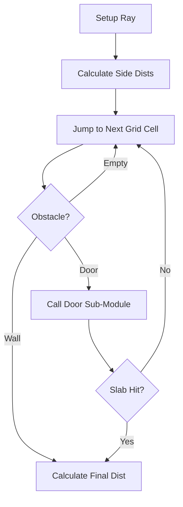

# 📏 DDA Grid Traversal Engine (`srcs/engine/physics/dda`)

---

## 🚧 Subsystem Boundary
> [!NOTE]
> **Trigger:** Called by the rendering engine (for wall casting) and the physics engine (for collision prediction).
> 
> **Output:** Returns the distance, side (N/S/E/W), and hit type for the first obstruction encountered by a ray.

---

## ✅ Responsibilities & ❌ Anti-Responsibilities
- **Must:** Implement the **Digital Differential Analyzer (DDA)** for O(N) grid stepping.
- **Must:** Handle both horizontal and vertical grid-line intersections with precision.
- **Must:** Integrate dynamic "slab" intersections for moving doors.
- **Must Not:** Draw pixels (delegated to `render/`).
- **Must Not:** Handle player movement logic (delegated to `gameplay/`).

---

## 🔄 DDA Traversal Pipeline

---

## 🧱 Sub-Modules Matrix
| Module | Role | Documentation |
| :--- | :--- | :--- |
| **`door/`** | Dynamic Slab Intersection | [README](door/README.md) |
| **`collision/`** | AABB & Grid Collision Logic | [README](collision/README.md) |
| **`dda.c`** | Core Traversal Loop | *Internal* |

---

## 🧬 Traversal Strategy
The DDA engine uses a **Dual-Pass** approach for doors:
1.  **Grid Step**: The standard DDA identifies that a door cell has been entered.
2.  **Slab Test**: The `door/` module solves the ray equation for a thin plane offset within that cell. This allows doors to appear "recessed" or "partially open" without breaking the core DDA stepping logic.

---

## ⚠️ Edge Cases & Gotchas
> [!IMPORTANT]
> **Precision Limits:** Floating point errors can cause a ray to skip the edge of a cell. The `utils.c` module uses a small `EPSILON` offset to ensure hits are registered correctly at cell boundaries.

---

## 🗂️ Files Inventory
| File | Role |
| :--- | :--- |
| `dda.c` | Primary DDA stepping algorithm. |
| `run.c` | Entry point for batch raycasting calls. |
| `door/` | Sub-module for interactive door geometry. |
| `collision/` | Sub-module for physical entity collisions. |
