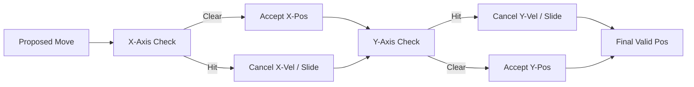
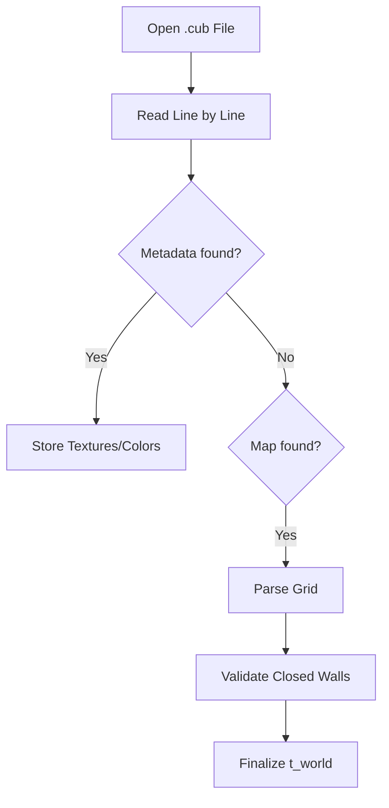

# 🛡️ Collision Detection Module (`srcs/engine/physics/dda/collision`)

---

## 🚧 Subsystem Boundary
> [!NOTE]
> **Trigger:** Called by the high-level physics orchestrator after a movement vector is proposed.
> 
> **Output:** A modified "safe" position vector that respects the physical boundaries of the world.

---

## ✅ Responsibilities & ❌ Anti-Responsibilities
- **Must:** Implement Axis-Aligned Bounding Box (AABB) checks for entities.
- **Must:** Calculate sliding planes when a movement vector hits a wall at an angle.
- **Must:** Resolve "step-up" or "clipping" issues at grid boundaries.
- **Must Not:** Perform grid traversal (delegated to `dda/run.c`).
- **Must Not:** Handle player interaction triggers (delegated to `dda/interaction.c`).

---

## 🔄 Collision Resolution Flow

---

## 🧬 Collision Logic Matrix
| Feature | Implementation | Notes |
| :--- | :--- | :--- |
| **AABB** | `collision.c` | Checks if player's bounding box intersects with '1' cells. |
| **Axis Separation** | `axis.c` | Independent X/Y resolution prevents sticking to walls. |
| **Buffer Zone** | `pos.c` | Maintains a small epsilon distance from walls to avoid float precision leaks. |

---

## ⚠️ Edge Cases & Gotchas
> [!CAUTION]
> **The "Corner Glitch":** Without axis separation, a player moving perfectly into a 90-degree corner might find a valid position *inside* the wall due to floating point rounding. The `axis.c` module ensures each dimension is validated sequentially to prevent this.

---

## 🗂️ Files Inventory
| File | Primary Function | Role |
| :--- | :--- | :--- |
| `collision.c` | `check_aabb()` | Core bounding box intersection logic. |
| `axis.c` | `resolve_axis()` | Handles independent coordinate validation. |
| `pos.c` | `get_safe_pos()` | Final coordinate assembly with safety buffers. |
| `pw.c` | `wall_normal()` | Calculates surface normals for sliding physics. |

---

## 🚧 Subsystem Boundary
> [!NOTE]
> **Trigger:** Called by all subsystems for specific utility tasks (parsing, math, exit handling).
> 
> **Output:** Provides validated results (like a parsed world state) or performs terminal actions (like printing errors and exiting).

---

## ✅ Responsibilities & ❌ Anti-Responsibilities
- **Must:** Parse and validate the `.cub` configuration file.
- **Must:** Provide high-level math utilities (distance, trigonometry).
- **Must:** Manage the application's "Safe Exit" lifecycle.
- **Must:** Implement generic string and list manipulation helpers.
- **Must Not:** Define core data structures (delegated to `primitives/`).
- **Must Not:** Contain game loop logic (delegated to `core/`).

---

## 🔄 Parsing Pipeline

---

## 💾 Memory Contracts (Critical)
| Function Allocates | Freeing Responsibility | Condition |
| :--- | :--- | :--- |
| `get_next_line()` | `parse_file()` | Temporary strings during parsing must be freed immediately after consumption. |
| `safe_exit()` | **Recursive Teardown** | This function is the ultimate "Memory Garbage Collector" during any exit scenario. |

---

## 🧬 Utility Matrix
| Feature | Implementation | Notes |
| :--- | :--- | :--- |
| **Parsing** | State-machine based | Handles metadata and map data in a single pass. |
| **Error Handling** | Prefix-based reporting | Prints "Error\n" followed by a specific message to `STDERR`. |
| **Math** | Fast lookup tables | (Optional) Can be used for trig functions if performance is critical. |

---

## ⚠️ Edge Cases & Gotchas
> [!CAUTION]
> **Hanging File Descriptors:** If parsing fails midway, the `safe_exit` routine must ensure that any open file descriptors are properly closed to avoid system resource exhaustion.

---

## 🗂️ Files Inventory
| File | Primary Function | Role |
| :--- | :--- | :--- |
| `parser.c` | `parse_cub()` | Orchestrates the translation of text files into world state. |
| `exit.c` | `safe_exit()` | Centralized error reporting and memory cleanup. |
| `maths.c` | `get_dist()` | General math utility library. |
| `debug.c` | `print_world()` | Internal tools for visualizing state during development. |
