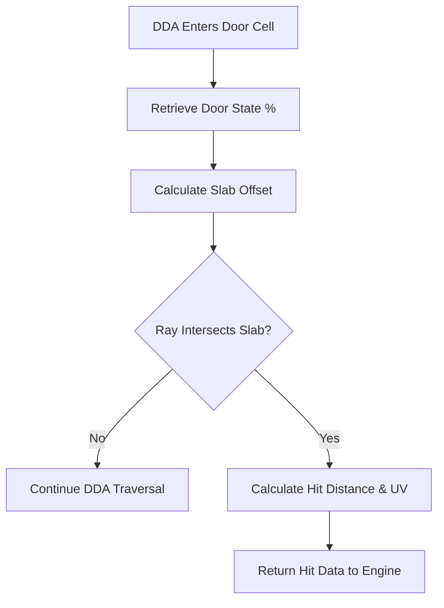

# 🚪 DDA Door Intersection Module (`srcs/engine/physics/dda/door`)

---

## 🚧 Subsystem Boundary
> [!NOTE]
> **Trigger:** Activated during DDA traversal when a ray enters a grid cell marked as a door ('D').
> 
> **Output:** Determines if the ray hits the door's "slab" based on its current animation percentage (opening/closing).

---

## ✅ Responsibilities & ❌ Anti-Responsibilities
- **Must:** Calculate the precise intersection point with the moving door slab.
- **Must:** Handle "sliding" doors where the hit depends on the horizontal/vertical offset within the cell.
- **Must:** Return the texture UV coordinates specifically for the door face.
- **Must Not:** Mutate the door state (delegated to `gameplay/entities/door/`).
- **Must Not:** Perform the initial DDA stepping (delegated to `physics/dda/dda.c`).

---

## 🔄 Door Intersection Pipeline

---

## 🧬 Slab Logic Matrix
| Feature | Implementation | Purpose |
| :--- | :--- | :--- |
| **Slab Intersection** | `slab.c` | Resolves the ray math for a thin, sliding plane. |
| **State Query** | `query.c` | Interfaces with `t_world` to get the door's opening %. |
| **Check** | `check.c` | Logic for identifying if a cell is an active door. |

---

## ⚠️ Edge Cases & Gotchas
> [!CAUTION]
> **Thin Planes:** A door is represented as a thin "slab" in the middle of a grid cell. The intersection math must account for the ray entering the *back* of a door if the player is standing inside the cell.

---

## 🗂️ Files Inventory
| File | Primary Function | Role |
| :--- | :--- | :--- |
| `slab.c` | `intersect_door_slab()` | Core math for ray-to-sliding-plane intersection. |
| `query.c` | `get_door_progress()` | Helper to retrieve animation status. |
| `check.c` | `is_door_hit()` | Dispatcher for door-specific DDA events. |
