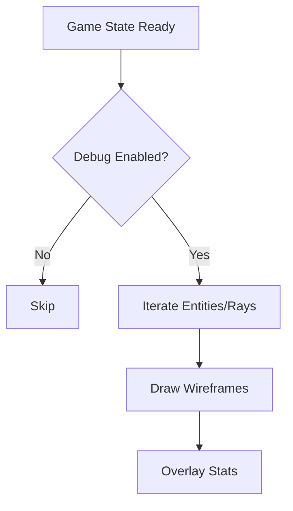
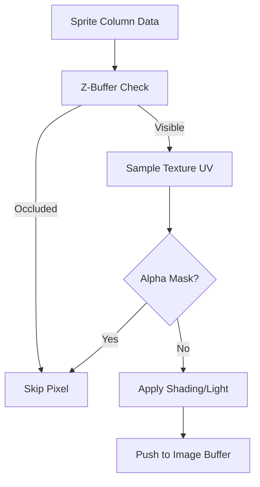
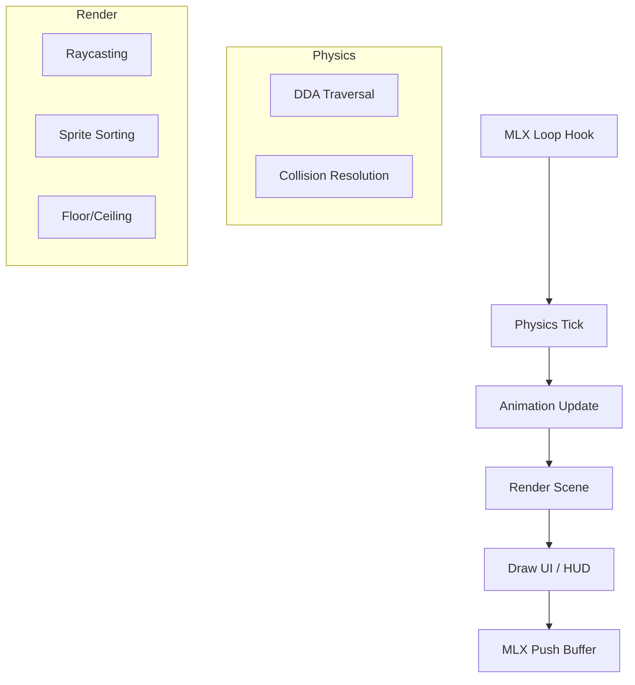

# 🛠️ Debug Rendering Tools (`srcs/engine/render/draw/debug`)

---

## 🚧 Subsystem Boundary
> [!NOTE]
> **Trigger:** Activated via specific compile-time flags or developer-only hotkeys.
> 
> **Output:** Draws wireframe overlays, ray paths, and AABBs directly over the game world to visualize internal engine logic.

---

## ✅ Responsibilities & ❌ Anti-Responsibilities
- **Must:** Visualize the 2D ray paths and their intersections with walls.
- **Must:** Draw Axis-Aligned Bounding Boxes (AABB) for collision validation.
- **Must:** Render the SAH BVH tree boundaries as 3D/2D wireframes.
- **Must Not:** Be visible in production builds.
- **Must Not:** Alter the game state (Read-Only observation).

---

## 🔄 Debug Pipeline

---

## 🧬 Debug Visualization Matrix
| Feature | Implementation | Purpose |
| :--- | :--- | :--- |
| **Collision AABB** | `shapes.c` | Visual confirmation of entity hitboxes. |
| **Ray Path** | `render.c` | Debugs DDA traversal and "leaks" through corners. |
| **BVH Bounds** | `render.c` | Visualizes the spatial partitioning efficiency. |

---

## ⚠️ Edge Cases & Gotchas
> [!CAUTION]
> **Performance Hit:** Rendering hundreds of debug rays or wireframes will significantly lower the frame rate. These tools are intended for static analysis or slow-motion debugging.

---

## 🗂️ Files Inventory
| File | Primary Function | Role |
| :--- | :--- | :--- |
| `render.c` | `draw_debug_overlay()` | Main entry point for the debug drawing phase. |
| `shapes.c` | `draw_wireframe_box()` | Utilities for drawing non-solid geometric shapes. |

---

## 🚧 Subsystem Boundary
> [!NOTE]
> **Trigger:** Called for each visible sprite after depth sorting and projection calculations.
> 
> **Output:** Pushes shaded and alpha-blended pixels directly to the primary image buffer.

---

## ✅ Responsibilities & ❌ Anti-Responsibilities
- **Must:** Handle 1-bit alpha transparency (XPM mask colors).
- **Must:** Perform vertical texture sampling for scaled sprite columns.
- **Must:** Respect the Z-Buffer to prevent sprites from rendering through walls.
- **Must Not:** Sort sprites (delegated to `sprites/sort.c`).
- **Must Not:** Calculate world-to-camera transformations (delegated to `sprites/pos.c`).

---

## 🔄 Pixel Processing Pipeline

---

## 🧬 Rendering Logic Matrix
| Feature | Implementation | Notes |
| :--- | :--- | :--- |
| **Alpha Blending** | Color Thresholding | Detects specific "transparent" hex codes in XPM data. |
| **Z-Occlusion** | Depth Comparison | Compares sprite distance vs wall distance stored in Z-buffer. |
| **Scaling** | Fixed-point sampling | Optimized for performance on CPU-based rendering. |

---

## ⚠️ Edge Cases & Gotchas
> [!CAUTION]
> **Precision Artifacts:** When sprites are extremely close to the camera, texture sampling must use guarded indices to prevent buffer overflows at the top/bottom edges of the screen.

---

## 🗂️ Files Inventory
| File | Primary Function | Role |
| :--- | :--- | :--- |
| `render.c` | `draw_sprite_pixel()` | Core inner loop for sprite pixel pushing. |
| `utils.c` | `get_sprite_tex()` | Helper for UV coordinate translation. |

---

## 🚧 Subsystem Boundary
> [!NOTE]
> **Trigger:** Orchestrated by `core/main.c`, this subsystem drives the entire game lifecycle through the MLX loop hooks.
> 
> **Output:** A fully processed and rendered game frame, incorporating physics resolution, entity animations, and pseudo-3D raycasting.

---

## ✅ Responsibilities & ❌ Anti-Responsibilities
- **Must:** Orchestrate the high-level flow: Update -> Render -> Display.
- **Must:** Synchronize world state between the physics and animation layers.
- **Must:** Optimize the rendering pipeline using the SAH BVH and spatial partitioning.
- **Must:** Manage global engine resources (texture caches, global timers).
- **Must Not:** Directly handle OS-level windowing (delegated to `window/`).
- **Must Not:** Perform raw map parsing (delegated to `helpers/parser/`).

---

## 🔄 Engine Orchestration Pipeline

---

## 🧱 Sub-Modules Matrix
| Module | Primary Responsibility | Documentation |
| :--- | :--- | :--- |
| **`physics/`** | Movement, DDA, and Collision resolution. | [README](physics/README.md) |
| **`animation/`** | Sprite rendering and entity state management. | [README](animation/render/README.md) |
| **`optimization/`** | SAH BVH build and spatial queries. | [README](optimization/README.md) |
| **`render/`** | High-level scene assembly and UI drawing. | *Internal* |

---

## 🧠 Global Engine Strategy
The engine follows a strict **Command & Control** pattern:
- **`engine.c`** (or `render_frame`) acts as the conductor, calling into specialized sub-modules in a specific order to ensure that collisions are resolved before animations are calculated, and animations are ticked before the final render.
- **Data Persistence**: Shared state like the **Z-Buffer** is generated during wall-casting and passed to the sprite-rendering module to handle occlusion.

---

## 🛡️ Memory & Resource Philosophy
> [!IMPORTANT]
> **Asset Lifecycle:** Textures and animation clips are shared resources managed via the `tex_cache`. They are loaded once at startup and reused across all entities to minimize memory footprint.

> [!CAUTION]
> **Thread Safety (Ready):** The engine is designed with a "Read-Only" render phase, meaning the world state is locked while the raycaster is walking the BVH, preparing the foundation for future multi-threaded optimizations.

---

## 🗂️ Files Inventory
| File | Role |
| :--- | :--- |
| `render/` | Handles the visual output (Raycasting, Sprites, HUD). |
| `physics/` | Handles the spatial logic (DDA, Collisions). |
| `animation/` | Handles dynamic world entities. |
| `optimization/` | Spatial acceleration structures (SAH BVH). |
