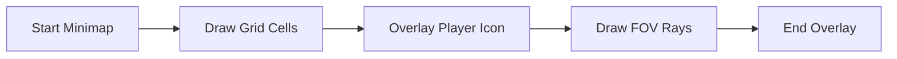

# 🗺️ Minimap Rendering Module (`srcs/engine/render/raycasting/minimap`)

---

## 🚧 Subsystem Boundary
> [!NOTE]
> **Trigger:** Called during the final UI overlay phase of the rendering pipeline.
> 
> **Output:** A 2D top-down representation of the player's immediate surroundings drawn directly onto the screen buffer.

---

## ✅ Responsibilities & ❌ Anti-Responsibilities
- **Must:** Render a scaled version of the world grid (walls, doors, portals).
- **Must:** Draw the player's position and view direction (FOV cone).
- **Must:** Support transparency to avoid obscuring the main 3D view.
- **Must Not:** Perform 3D raycasting (delegated to `raycasting/`).
- **Must Not:** Resolve player movement (delegated to `physics/`).

---

## 🔄 Minimap Pipeline

---

## 🧬 Logic Matrix
| Feature | Implementation | Purpose |
| :--- | :--- | :--- |
| **Grid** | `grid.c` | Maps the `t_world` grid to screen pixels. |
| **Player** | `player.c` | Handles the position and rotation of the player icon. |
| **Composite** | `minimap.c` | Orchestrates the background and foreground layers. |

---

## ⚠️ Edge Cases & Gotchas
> [!CAUTION]
> **Map Bounds:** If the player is near the edge of a very large map, the minimap should ideally crop the view to a local radius around the player to save performance and screen space.

---

## 🗂️ Files Inventory
| File | Primary Function | Role |
| :--- | :--- | :--- |
| `minimap.c` | `render_minimap()` | Entry point for the 2D overlay phase. |
| `grid.c` | `draw_grid()` | Visualizes the wall and floor layout. |
| `player.c` | `draw_player_icon()` | Renders the player indicator and direction. |
