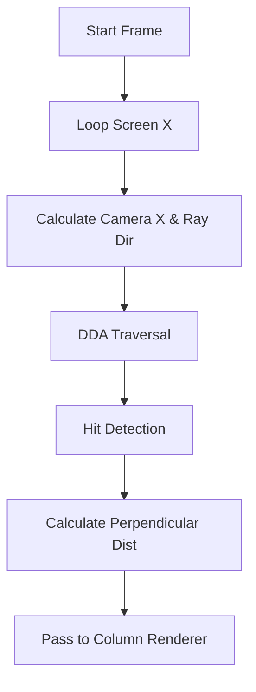

# 📐 Raycasting Engine (`srcs/engine/render/raycasting/raycasting`)

---

## 🚧 Subsystem Boundary
> [!NOTE]
> **Trigger:** Called by the scene assembler to generate the world geometry for each frame.
> 
> **Output:** Performs horizontal and vertical scanline tests to determine visible surfaces and their distances.

---

## ✅ Responsibilities & ❌ Anti-Responsibilities
- **Must:** Calculate ray directions based on the camera plane and FOV.
- **Must:** Integrate the DDA algorithm for fast grid stepping.
- **Must:** Correct the fish-eye distortion by projecting rays onto the camera plane.
- **Must Not:** Draw pixels directly (delegated to `column/` and `floor/`).
- **Must Not:** Handle sprite rendering (delegated to `sprites/`).

---

## 🔄 Projection Pipeline

---

## 🧬 Engine Matrix
| Module | Role | Notes |
| :--- | :--- | :--- |
| **`scene/`** | Orchestrator | Combines walls, floors, and sprites. |
| **`column/`** | Wall Renderer | Draws textured vertical strips. |
| **`floor/`** | Background Renderer | Fills floor and ceiling planes. |
| **`strip.c`** | Logic | Manages the individual ray-casting parameters. |

---

## ⚠️ Edge Cases & Gotchas
> [!IMPORTANT]
> **Z-Buffer Generation:** This module is responsible for populating the Z-Buffer during the wall-casting phase, which is critical for correct sprite occlusion later in the pipeline.

> [!TIP]
> **Multi-Pass Painter's Algorithm:** To support viewing walls behind partially open or transparent doors, `strip.c` implements a multi-hit DDA collector. It intercepts the door, records the hit, and resumes the exact same ray traversal (without restarting from the origin) until it finds a solid, opaque wall. The collected hits are then drawn back-to-front (wall first, then the door).

---

## 🗂️ Files Inventory
| File | Primary Function | Role |
| :--- | :--- | :--- |
| `strip.c` | `cast_ray()` | Core logic for a single vertical slice of the world. |
| `scene/` | N/A | Sub-module for high-level frame assembly. |
| `column/` | N/A | Sub-module for wall texture drawing. |
| `floor/` | N/A | Sub-module for horizontal plane rendering. |
