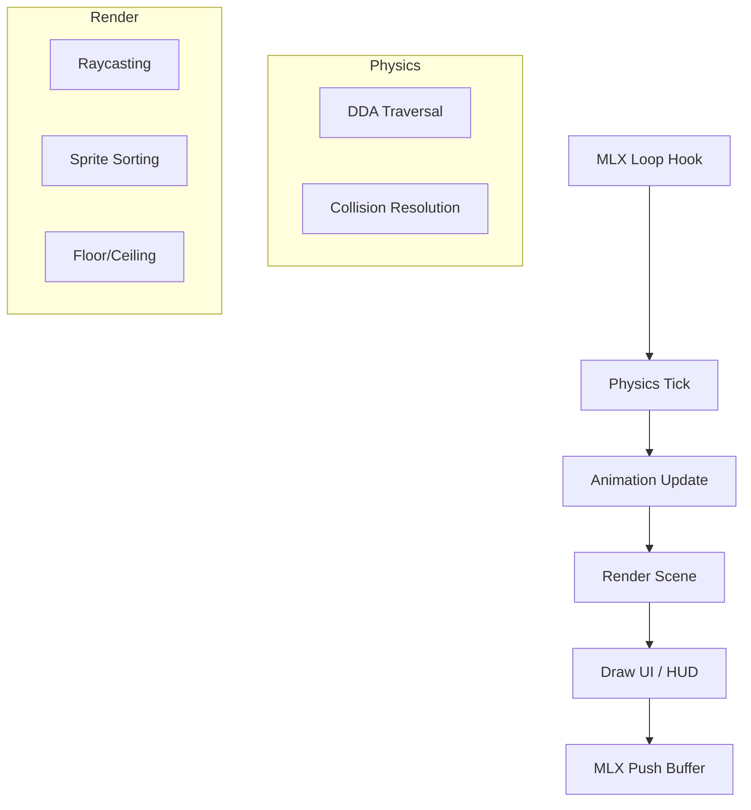

# 🧱 Wall Column Renderer (`srcs/engine/render/raycasting/raycasting/column`)


---

## 🚧 Subsystem Boundary
> [!NOTE]
> **Trigger:** Called once for every vertical scanline (width of the screen) during the raycasting phase.
> 
> **Output:** Draws a single textured vertical strip representing a wall segment.

---

## ✅ Responsibilities & ❌ Anti-Responsibilities
- **Must:** Calculate the vertical span (top/bottom) of the wall based on perpendicular distance.
- **Must:** Perform UV mapping by identifying the X-coordinate on the wall face.
- **Must:** Scale textures vertically using fixed-point arithmetic for speed.
- **Must Not:** Perform the raycasting itself (delegated to `render/raycasting/`).
- **Must Not:** Draw floor or ceiling (delegated to `floor/`).

---

## 🔄 Column Drawing Flow
```mermaid
graph TD
    A[Wall Hit Info] --> B[Calculate Perpendicular Dist]
    B --> C[Determine Line Height]
    C --> D[Calculate Texture X (U)]
    D --> E[Loop Scanline Y from Top to Bottom]
    E --> F[Calculate Texture Y (V)]
    F --> G[Sample Texture & Push Pixel]
```

---

## 🧬 Column Logic Matrix
| Feature | Implementation | Notes |
| :--- | :--- | :--- |
| **Perspective** | `1/Dist` Scaling | Ensures walls look smaller as they move away. |
| **UV Mapping** | Intersection Fraction | Determines which column of the texture to sample. |
| **Fixed-Point** | `step` Accumulator | Avoids float division in the inner pixel loop. |

---

## ⚠️ Edge Cases & Gotchas
> [!IMPORTANT]
> **Wall Face Detection:** The renderer must know which face of the wall (North, South, East, West) was hit to select the correct texture and apply the appropriate shading (brightness offset).

> [!CAUTION]
> **Door Z-Offset Clipping:** When rendering opening doors, their vertical position shifts upwards based on their `open_at` percentage. To prevent the door from drawing over the ceiling texture (especially when looking up/down with pitch), the top rendering bound (`r.x`) is strictly clamped to the ceiling baseline (`dsb`), ensuring the door disappears *behind* the ceiling.

---

## 🗂️ Files Inventory
| File | Primary Function | Role |
| :--- | :--- | :--- |
| `draw.c` | `draw_column()` | Inner loop for vertical strip rendering. |
| `texture.c` | `sample_texture()` | High-performance pixel retrieval from XPM data. |

---

## 🚧 Subsystem Boundary
> [!NOTE]
> **Trigger:** Orchestrated by `core/main.c`, this subsystem drives the entire game lifecycle through the MLX loop hooks.
> 
> **Output:** A fully processed and rendered game frame, incorporating physics resolution, entity animations, and pseudo-3D raycasting.

---

## ✅ Responsibilities & ❌ Anti-Responsibilities
- **Must:** Orchestrate the high-level flow: Update -> Render -> Display.
- **Must:** Synchronize world state between the physics and animation layers.
- **Must:** Optimize the rendering pipeline using the SAH BVH and spatial partitioning.
- **Must:** Manage global engine resources (texture caches, global timers).
- **Must Not:** Directly handle OS-level windowing (delegated to `window/`).
- **Must Not:** Perform raw map parsing (delegated to `helpers/parser/`).

---

## 🔄 Engine Orchestration Pipeline


---

## 🧱 Sub-Modules Matrix
| Module | Primary Responsibility | Documentation |
| :--- | :--- | :--- |
| **`physics/`** | Movement, DDA, and Collision resolution. | [README](physics/README.md) |
| **`animation/`** | Sprite rendering and entity state management. | [README](animation/render/README.md) |
| **`optimization/`** | SAH BVH build and spatial queries. | [README](optimization/README.md) |
| **`render/`** | High-level scene assembly and UI drawing. | *Internal* |

---

## 🧠 Global Engine Strategy
The engine follows a strict **Command & Control** pattern:
- **`engine.c`** (or `render_frame`) acts as the conductor, calling into specialized sub-modules in a specific order to ensure that collisions are resolved before animations are calculated, and animations are ticked before the final render.
- **Data Persistence**: Shared state like the **Z-Buffer** is generated during wall-casting and passed to the sprite-rendering module to handle occlusion.

---

## 🛡️ Memory & Resource Philosophy
> [!IMPORTANT]
> **Asset Lifecycle:** Textures and animation clips are shared resources managed via the `tex_cache`. They are loaded once at startup and reused across all entities to minimize memory footprint.

> [!CAUTION]
> **Thread Safety (Ready):** The engine is designed with a "Read-Only" render phase, meaning the world state is locked while the raycaster is walking the BVH, preparing the foundation for future multi-threaded optimizations.

---

## 🗂️ Files Inventory
| File | Role |
| :--- | :--- |
| `render/` | Handles the visual output (Raycasting, Sprites, HUD). |
| `physics/` | Handles the spatial logic (DDA, Collisions). |
| `animation/` | Handles dynamic world entities. |
| `optimization/` | Spatial acceleration structures (SAH BVH). |
