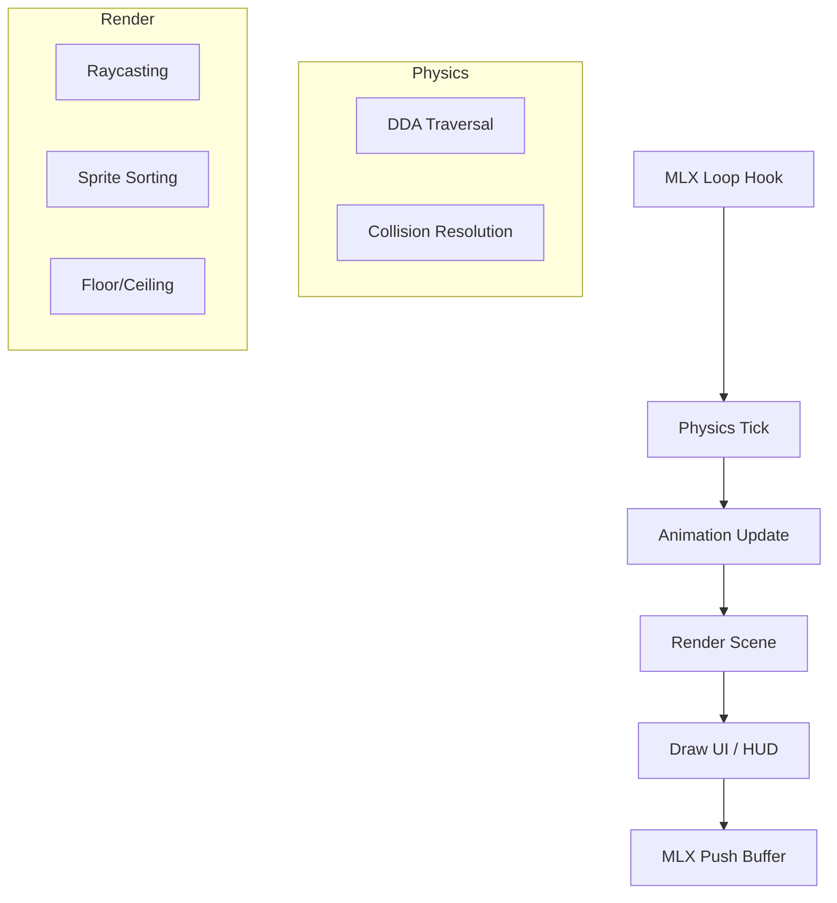

# 🪵 Floor & Ceiling Engine (`srcs/engine/render/raycasting/raycasting/floor`)

---

## 🚧 Subsystem Boundary
> [!NOTE]
> **Trigger:** Executed at the beginning of the frame to provide the background context for the walls.
> 
> **Output:** Populates the upper and lower halves of the screen with either solid colors or textured planes.

---

## ✅ Responsibilities & ❌ Anti-Responsibilities
- **Must:** Implement efficient horizontal scanline rendering.
- **Must:** Support both solid color fills and textured floor/ceiling planes.
- **Must:** Calculate correct perspective projection for horizontal surfaces.
- **Must Not:** Draw vertical walls (delegated to `column/`).
- **Must Not:** Handle sprite occlusion (delegated to `sprites/`).

---

## 🔄 Rendering Logic

---

## 🧬 Floor Logic Matrix
| Feature | Implementation | Notes |
| :--- | :--- | :--- |
| **Solid Fill** | Loop-based fill | Fast fallback for simple configurations. |
| **Texture Mapping** | Plane projection | Advanced mapping for realistic environments. |
| **Pixel Mapping** | `pixel.c` | Optimized inner loop for direct buffer writing. |

---

## ⚠️ Edge Cases & Gotchas
> [!WARNING]
> **Precision at Horizon:** As scanlines approach the horizon, the depth value approaches infinity. The implementation must include a distance cutoff to prevent floating point instability.

---

## 🗂️ Files Inventory
| File | Primary Function | Role |
| :--- | :--- | :--- |
| `params.c` | `init_floor_params()` | Pre-calculates constants for plane projection. |
| `pixel.c` | `draw_floor_pixel()` | Low-level pixel sampling and pushing. |

---

## 🚧 Subsystem Boundary
> [!NOTE]
> **Trigger:** Orchestrated by `core/main.c`, this subsystem drives the entire game lifecycle through the MLX loop hooks.
> 
> **Output:** A fully processed and rendered game frame, incorporating physics resolution, entity animations, and pseudo-3D raycasting.

---

## ✅ Responsibilities & ❌ Anti-Responsibilities
- **Must:** Orchestrate the high-level flow: Update -> Render -> Display.
- **Must:** Synchronize world state between the physics and animation layers.
- **Must:** Optimize the rendering pipeline using the SAH BVH and spatial partitioning.
- **Must:** Manage global engine resources (texture caches, global timers).
- **Must Not:** Directly handle OS-level windowing (delegated to `window/`).
- **Must Not:** Perform raw map parsing (delegated to `helpers/parser/`).

---

## 🔄 Engine Orchestration Pipeline

---

## 🧱 Sub-Modules Matrix
| Module | Primary Responsibility | Documentation |
| :--- | :--- | :--- |
| **`physics/`** | Movement, DDA, and Collision resolution. | [README](physics/README.md) |
| **`animation/`** | Sprite rendering and entity state management. | [README](animation/render/README.md) |
| **`optimization/`** | SAH BVH build and spatial queries. | [README](optimization/README.md) |
| **`render/`** | High-level scene assembly and UI drawing. | *Internal* |

---

## 🧠 Global Engine Strategy
The engine follows a strict **Command & Control** pattern:
- **`engine.c`** (or `render_frame`) acts as the conductor, calling into specialized sub-modules in a specific order to ensure that collisions are resolved before animations are calculated, and animations are ticked before the final render.
- **Data Persistence**: Shared state like the **Z-Buffer** is generated during wall-casting and passed to the sprite-rendering module to handle occlusion.

---

## 🛡️ Memory & Resource Philosophy
> [!IMPORTANT]
> **Asset Lifecycle:** Textures and animation clips are shared resources managed via the `tex_cache`. They are loaded once at startup and reused across all entities to minimize memory footprint.

> [!CAUTION]
> **Thread Safety (Ready):** The engine is designed with a "Read-Only" render phase, meaning the world state is locked while the raycaster is walking the BVH, preparing the foundation for future multi-threaded optimizations.

---

## 🗂️ Files Inventory
| File | Role |
| :--- | :--- |
| `render/` | Handles the visual output (Raycasting, Sprites, HUD). |
| `physics/` | Handles the spatial logic (DDA, Collisions). |
| `animation/` | Handles dynamic world entities. |
| `optimization/` | Spatial acceleration structures (SAH BVH). |
