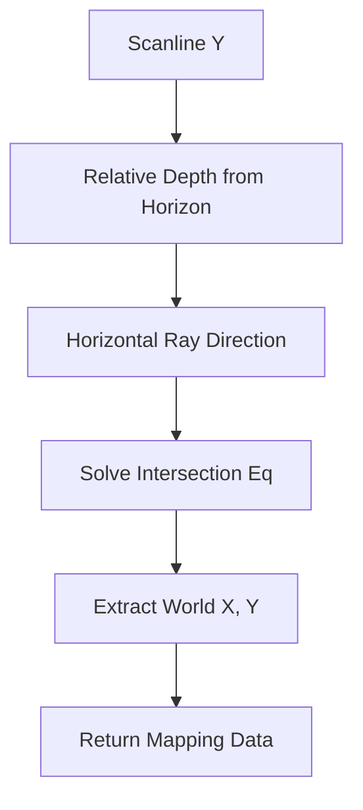

# ✈️ Plane Intersection Module (`srcs/engine/render/raycasting/raycasting/floor/planes`)

---

## 🚧 Subsystem Boundary
> [!NOTE]
> **Trigger:** Called by the floor engine for every horizontal scanline.
> 
> **Output:** Provides the exact world-space coordinates (X, Y) where a ray intersects with the floor or ceiling plane.

---

## ✅ Responsibilities & ❌ Anti-Responsibilities
- **Must:** Solve the ray-plane intersection equation for horizontal surfaces.
- **Must:** Handle perspective distortion for floor textures.
- **Must:** Provide high-precision coordinates for UV mapping.
- **Must Not:** Draw pixels to the buffer (delegated to `floor/pixel.c`).
- **Must Not:** Perform wall DDA (delegated to `physics/dda/`).

---

## 🔄 Plane Intersection Math

---

## 🧬 Plane Logic Matrix
| Operation | Implementation | Purpose |
| :--- | :--- | :--- |
| **Depth Projection** | `planes.c` | Maps screen Y to world distance. |
| **Coordinate Mapping** | `utils.c` | Translates camera space to world space grid. |
| **Batch Render** | `render.c` | Optimizes calculations for groups of pixels. |

---

## ⚠️ Edge Cases & Gotchas
> [!CAUTION]
> **Horizon Singularity:** At the exact horizontal center of the screen, the intersection distance is undefined (infinity). The math must be clamped to prevent `division by zero` or `NaN` errors.

---

## 🗂️ Files Inventory
| File | Primary Function | Role |
| :--- | :--- | :--- |
| `planes.c` | `get_intersection()` | Core geometric math for plane mapping. |
| `render.c` | `render_plane_strip()` | Orchestrates the scanline math calls. |
| `utils.c` | `uv_calculate()` | Helper for sub-grid texture coordinates. |
