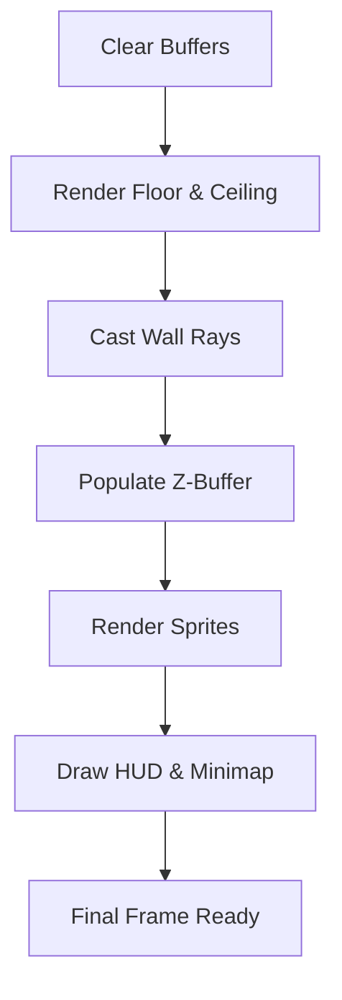

# 🎬 Scene Assembly Module (`srcs/engine/render/raycasting/raycasting/scene`)

---

## 🚧 Subsystem Boundary
> [!NOTE]
> **Trigger:** Called by the main engine loop to prepare the entire visual frame.
> 
> **Output:** A complete composite image containing walls, floor, ceiling, sprites, and the HUD.

---

## ✅ Responsibilities & ❌ Anti-Responsibilities
- **Must:** Orchestrate the order of rendering (Floor/Ceiling -> Walls -> Sprites -> HUD).
- **Must:** Manage the primary screen buffer and Z-buffer memory.
- **Must:** Synchronize the camera state across all rendering sub-modules.
- **Must Not:** Perform individual ray-casts (delegated to `render/raycasting/`).
- **Must Not:** Resolve physics (delegated to `physics/`).

---

## 🔄 Assembly Pipeline

---

## 🧬 Scene Logic Matrix
| Phase | Sub-Module | Purpose |
| :--- | :--- | :--- |
| **Background** | `floor/` | Fills the top and bottom halves of the screen. |
| **Geometry** | `column/` | Draws vertical wall strips with perspective correction. |
| **Entities** | `sprites/` | Layers dynamic objects over the geometry. |
| **UI** | `draw/` | Overlays HUD, crosshair, and performance metrics. |

---

## ⚠️ Edge Cases & Gotchas
> [!CAUTION]
> **Frame Synchronization:** The scene must be rendered into an off-screen buffer (double buffering) before being pushed to the window to prevent flickering.

---

## 🗂️ Files Inventory
| File | Primary Function | Role |
| :--- | :--- | :--- |
| `scene.c` | `render_scene()` | Primary coordinator for the rendering sequence. |
| `utils.c` | `clear_buffers()` | Resets image and depth buffers for the next frame. |
