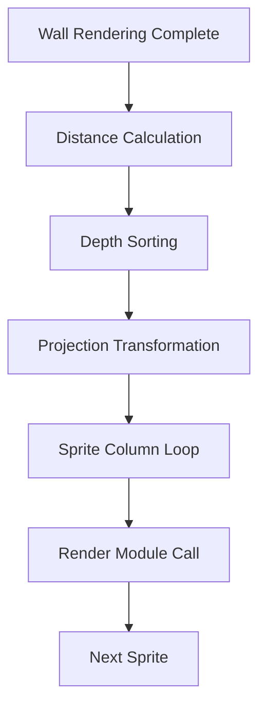

# 🎭 Sprite Orchestration Subsystem (`srcs/engine/render/raycasting/sprites`)

---

## 🚧 Subsystem Boundary
> [!NOTE]
> **Trigger:** Activated by the scene assembler after all wall rays have been cast.
> 
> **Output:** Coordinates the projection and rendering of all dynamic entities (enemies, items, decorations) in the world.

---

## ✅ Responsibilities & ❌ Anti-Responsibilities
- **Must:** Calculate the Euclidean distance of all sprites to the player.
- **Must:** Sort sprites from farthest to nearest (Painter's Algorithm) to ensure correct layering.
- **Must:** Transform world-space sprite positions into camera-space.
- **Must Not:** Draw individual pixels (delegated to `sprites/render/`).
- **Must Not:** Handle sprite animation frames (delegated to `engine/animation/`).

---

## 🔄 Orchestration Flow

---

## 🧬 Sprite Logic Matrix
| Feature | Implementation | Notes |
| :--- | :--- | :--- |
| **Depth Sorting** | `sort.c` | Uses distance squared for performance optimization. |
| **Projection** | `pos.c` | Converts X/Y coordinates into screen-space column indices. |
| **Execution** | `draw.c` | High-level loop that iterates through the sorted sprite list. |

---

## ⚠️ Edge Cases & Gotchas
> [!IMPORTANT]
> **Occlusion Sync:** The sprite system MUST have access to the `z_buffer` generated by the wall raycaster. If a sprite is closer to the camera than the wall hit at a specific X-coordinate, it is drawn; otherwise, it is skipped.

---

## 🗂️ Files Inventory
| File | Primary Function | Role |
| :--- | :--- | :--- |
| `draw.c` | `sprites_draw()` | Main entry point for the sprite rendering phase. |
| `sort.c` | `sprites_sort()` | Implements depth sorting for the Painter's Algorithm. |
| `pos.c` | `sprites_project()` | Calculates camera-space transformations. |
