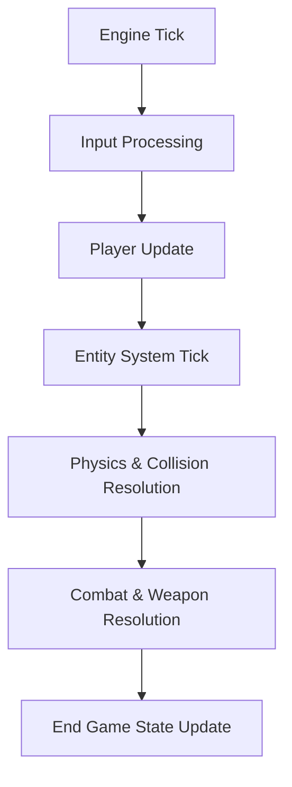

# 🎮 Gameplay Subsystem (`srcs/gameplay`)

---

## 🚧 Subsystem Boundary
> [!NOTE]
> **Trigger:** Activated by MLX input hooks and the core engine tick.
> 
> **Output:** Mutates the world state (`t_world`) and entity states, providing the data necessary for each frame's render.

---

## ✅ Responsibilities & ❌ Anti-Responsibilities
- **Must:** Orchestrate the high-level logic for all dynamic objects (Player, Monsters, Items).
- **Must:** Manage the global game tick and delta-time synchronization.
- **Must:** Resolve interactions between entities and the environment (Doors, Walls).
- **Must Not:** Draw pixels (delegated to `engine/render/`).
- **Must Not:** Handle raw map parsing (delegated to `helpers/parser/`).

---

## 🔄 Gameplay Hub Pipeline

---

## 🧱 Sub-Modules Matrix
| Module | Role | Documentation |
| :--- | :--- | :--- |
| **`player/`** | User Control & State | [README](player/README.md) |
| **`entities/`** | World Objects & Lifecycle | [README](entities/system/README.md) |
| **`loop/`** | Tick Orchestration | [README](loop/README.md) |
| **`weapon/`** | Combat Logic | [README](weapon/README.md) |
| **`pathfinder/`** | AI Navigation | [README](pathfinder/README.md) |

---

## ⚠️ Edge Cases & Gotchas
> [!IMPORTANT]
> **Deterministic Logic:** To ensure stability across different hardware, the gameplay layer must rely on fixed-rate or delta-time scaling for all movement and combat calculations.

---

## 🗂️ Files Inventory
| File | Role |
| :--- | :--- |
| `player/` | Handles user inputs and movement. |
| `entities/` | Manages monsters, items, and doors. |
| `weapon/` | Resolves combat and damage. |
| `pathfinder/` | Provides AI navigation data. |
| `loop/` | Orchestrates the per-frame updates. |
