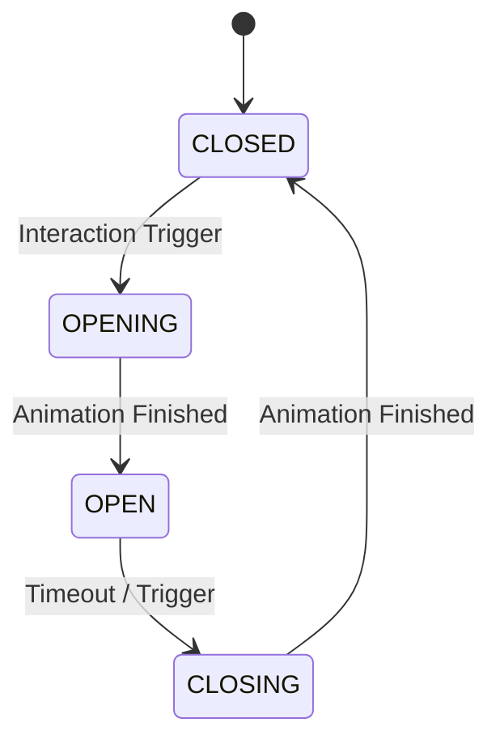

# 🚪 Door Entity Logic (`srcs/gameplay/entities/door`)

---

## 🚧 Subsystem Boundary
> [!NOTE]
> **Trigger:** Activated by the player's interaction key or automated world triggers.
> 
> **Output:** Mutates the grid state in `t_world` and updates visual animation frames for the rendering engine.

---

## ✅ Responsibilities & ❌ Anti-Responsibilities
- **Must:** Manage the transition between `OPEN`, `CLOSED`, `OPENING`, and `CLOSING` states.
- **Must:** Update the physical collision grid when a door is fully open (non-blocking) or closed (blocking).
- **Must:** Play the correct animation sequence based on time delta.
- **Must Not:** Handle ray-casting logic (delegated to `engine/physics/dda/`).
- **Must Not:** Handle player inventory/keys (delegated to `gameplay/player/`).

---

## 🔄 Door State Machine

---

## 🧬 Logic Matrix
| State | Physical Behavior | Visual Behavior |
| :--- | :--- | :--- |
| **CLOSED** | Fully Blocking | Static "Closed" Texture |
| **OPENING** | Partially Blocking | Animated Sequence |
| **OPEN** | Non-Blocking | Static "Open" Texture |
| **CLOSING** | Partially Blocking | Reversed Animated Sequence |

---

## ⚠️ Edge Cases & Gotchas
> [!CAUTION]
> **Stuck Entities:** If a door closes while an entity (player/monster) is inside its cell, the logic must either push the entity out or prevent the door from fully closing to avoid physical clipping errors.

---

## 🗂️ Files Inventory
| File | Primary Function | Role |
| :--- | :--- | :--- |
| `tick.c` | `door_tick()` | Updates animation timers and state transitions. |
| `update.c` | `door_grid_update()` | Modifies the world map's collision data. |
| `finish.c` | `door_on_finish()` | Finalizes transitions (e.g., locking state). |
