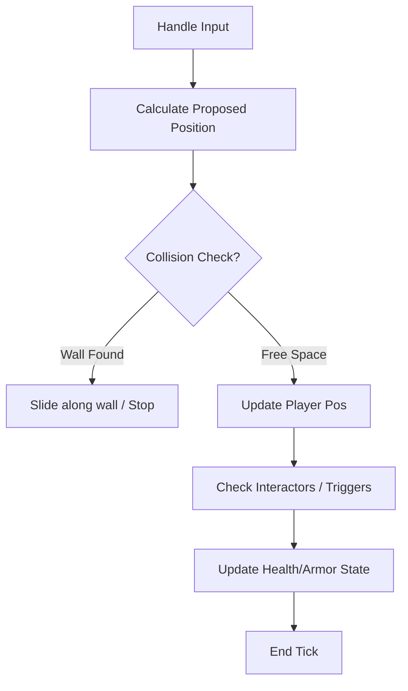

# 🎮 Gameplay Subsystem (`srcs/gameplay`)

---

## 🚧 Subsystem Boundary
> [!NOTE]
> **Trigger:** Activated by MLX input hooks (keypress/mouse move) and every frame tick.
> 
> **Output:** Mutates the `t_player` and `t_world` state, which is subsequently consumed by the rendering engine.

---

## ✅ Responsibilities & ❌ Anti-Responsibilities
- **Must:** Handle smooth player movement and rotation.
- **Must:** Implement robust AABB or circle-based collision detection with walls.
- **Must:** Manage player health, armor, and interaction states.
- **Must:** Drive entity/sprite logic (animations, pathfinding if applicable).
- **Must Not:** Draw pixels to the screen (delegated to `engine/`).
- **Must Not:** Manage the raw event loop (delegated to `window/`).

---

## 🔄 Logic Pipeline

---

## 💾 Memory Contracts (Critical)
| Function Allocates | Freeing Responsibility | Condition |
| :--- | :--- | :--- |
| `init_gameplay()` | `safe_exit()` | Allocates sprite lists or dynamic entity arrays. |

---

## 🧬 Gameplay Mechanics Matrix
| Feature | Implementation | Notes |
| :--- | :--- | :--- |
| **Movement** | Velocity-based with Delta Time | Ensures consistency across different frame rates. |
| **Collision** | Radius-based sphere checking | Prevents the player from getting "stuck" in wall corners. |
| **Interaction** | Ray-based "Use" action | Allows interacting with doors or switches within a range. |

---

## ⚠️ Edge Cases & Gotchas
> [!CAUTION]
> **Corner Clipping:** When moving diagonally into a corner, the physics engine must ensure the player doesn't "pop" through the wall by resolving X and Y collisions independently.

---

## 🗂️ Files Inventory
| File | Primary Function | Role |
| :--- | :--- | :--- |
| `movement.c` | `update_pos()` | Handles translation and rotation logic. |
| `collision.c` | `check_collision()` | Validates proposed moves against the map geometry. |
| `interact.c` | `handle_interaction()` | Triggers doors or other interactive map elements. |
| `tick.c` | `gameplay_tick()` | Orchestrates all logic updates for a single frame. |
