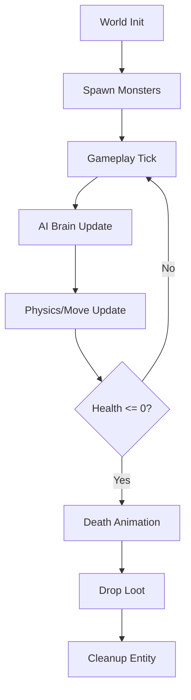

# 👾 Monster Entity Orchestrator (`srcs/gameplay/entities/monster`)

---

## 🚧 Subsystem Boundary
> [!NOTE]
> **Trigger:** Called every frame by the main gameplay tick handler.
> 
> **Output:** Manages the full lifecycle of all non-player characters (NPCs) from spawning to death.

---

## ✅ Responsibilities & ❌ Anti-Responsibilities
- **Must:** Orchestrate the AI -> Movement -> Animation loop for all monsters.
- **Must:** Handle health depletion and death state transitions.
- **Must:** Manage loot table rolls and item spawning on monster death.
- **Must Not:** Draw sprites (delegated to `engine/render/`).
- **Must Not:** Handle player-specific logic (delegated to `gameplay/player/`).

---

## 🔄 Lifecycle Pipeline

---

## 🧱 Sub-Modules Matrix
| Module | Role | Documentation |
| :--- | :--- | :--- |
| **`ai/`** | Behavioral Decision Making | [README](ai/README.md) |
| **`move/`** | Physical Displacement | [README](move/README.md) |
| **`loot.c`** | Item Drop Management | *Internal* |
| **`tick.c`** | Main Orchestration | *Internal* |

---

## ⚠️ Edge Cases & Gotchas
> [!IMPORTANT]
> **Performance Scaling:** The orchestrator must efficiently handle large numbers of entities by culling logic for monsters that are far outside the player's active bubble.

---

## 🗂️ Files Inventory
| File | Primary Function | Role |
| :--- | :--- | :--- |
| `tick.c` | `monsters_tick()` | Central loop for updating all monster instances. |
| `loot.c` | `drop_loot()` | Logic for spawning item entities on death. |
