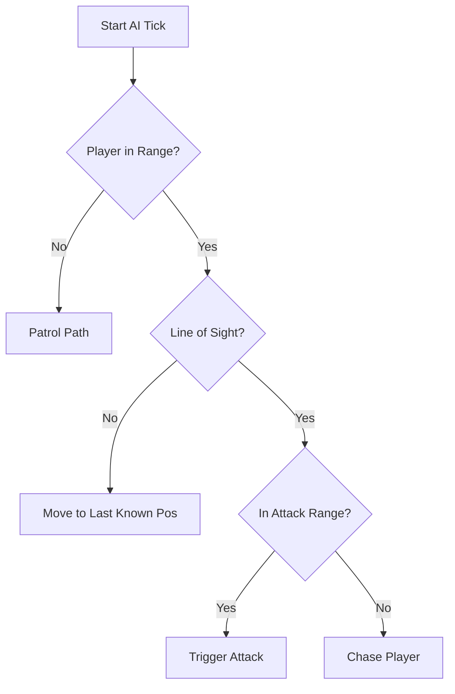

# 🧠 Monster AI Brain (`srcs/gameplay/entities/monster/ai`)

---

## 🚧 Subsystem Boundary
> [!NOTE]
> **Trigger:** Called during the gameplay tick for every active monster entity in the world.
> 
> **Output:** Decides the monster's next action (Move, Attack, Wait) based on player proximity and visibility.

---

## ✅ Responsibilities & ❌ Anti-Responsibilities
- **Must:** Implement Line-of-Sight (LOS) algorithms using ray-casting.
- **Must:** Manage behavioral states: Patrol, Chase, Attack, and Flee.
- **Must:** Calculate pathing directions towards the player's last known position.
- **Must Not:** Handle physical movement (delegated to `monster/move/`).
- **Must Not:** Handle damage calculations (delegated to `gameplay/combat/`).

---

## 🔄 AI Decision Tree

---

## 🧬 Behavioral Matrix
| State | Logic Module | Target |
| :--- | :--- | :--- |
| **Patrol** | `patrol.c` | Waypoint sequence or random roam. |
| **Chase** | `chase.c` | Player's current X/Y coordinates. |
| **Attack** | `attack.c` | Player's health component. |
| **LOS Check** | `los.c` | Ray-trace between Monster and Player. |

---

## ⚠️ Edge Cases & Gotchas
> [!IMPORTANT]
> **Raycast Cost:** Performing LOS checks for dozens of monsters every frame is expensive. The implementation uses a "tick-staggering" or distance-based frequency to maintain 60 FPS.

---

## 🗂️ Files Inventory
| File | Primary Function | Role |
| :--- | :--- | :--- |
| `los.c` | `check_los()` | Ray-casting utility for visibility testing. |
| `patrol.c` | `update_patrol()` | Logic for idle movement and waypoint following. |
| `chase.c` | `update_chase()` | Navigation towards the player. |
| `attack.c` | `update_attack()` | Range-based trigger for combat actions. |
| `aggro.c` | `check_aggro()` | Range and sound-based alertness logic. |
