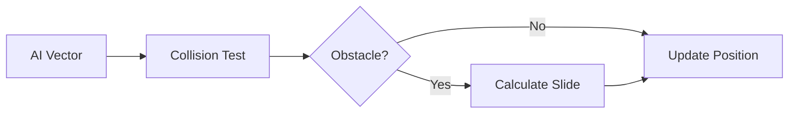

# 👣 Monster Movement Module (`srcs/gameplay/entities/monster/move`)

---

## 🚧 Subsystem Boundary
> [!NOTE]
> **Trigger:** Called after the AI module has decided on a movement vector.
> 
> **Output:** Updates the monster's `t_vec2` position while resolving collisions with walls and other entities.

---

## ✅ Responsibilities & ❌ Anti-Responsibilities
- **Must:** Apply velocity vectors to the current monster position.
- **Must:** Perform collision checks with the world grid (DDA-based).
- **Must:** Resolve "sliding" physics to prevent monsters from getting stuck on walls.
- **Must Not:** Decide *where* to move (delegated to `monster/ai/`).
- **Must Not:** Animate the movement (delegated to `engine/animation/`).

---

## 🔄 Movement Pipeline

---

## 🧬 Kinematics Matrix
| Feature | Implementation | Purpose |
| :--- | :--- | :--- |
| **Collision** | Grid-cell check | Prevents clipping into walls. |
| **Sliding** | Normal projection | Allows smooth movement along wall surfaces. |
| **Entity Avoidance** | Radius check | Prevents monsters from overlapping each other. |

---

## ⚠️ Edge Cases & Gotchas
> [!CAUTION]
> **Tunnelling:** High-speed monsters might "jump" over thin walls. The `apply.c` logic uses sub-step validation to ensure no boundaries are crossed between frames.

---

## 🗂️ Files Inventory
| File | Primary Function | Role |
| :--- | :--- | :--- |
| `apply.c` | `monster_move()` | Final position resolution and collision handling. |
