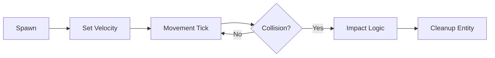

# 🚀 Projectile Module (`srcs/gameplay/entities/projectile`)

---

## 🚧 Subsystem Boundary
> [!NOTE]
> **Trigger:** Spawned by weapons (player/monster) or world traps.
> 
> **Output:** Moves through the world until it impacts a wall or entity, triggering damage events.

---

## ✅ Responsibilities & ❌ Anti-Responsibilities
- **Must:** Calculate the trajectory and velocity of fired projectiles.
- **Must:** Perform continuous collision checks (AABB) during movement.
- **Must:** Handle impact effects (explosions, decals, or damage dispatch).
- **Must Not:** Draw pixels (delegated to `engine/render/`).
- **Must Not:** Decide *when* to fire (delegated to `weapon/` or `monster/ai/`).

---

## 🔄 Projectile Lifecycle

---

## 🧬 Projectile Matrix
| Feature | Implementation | Notes |
| :--- | :--- | :--- |
| **Spawning** | `spawn.c` | Sets origin, direction, and owner (to prevent self-damage). |
| **Movement** | `tick.c` | Uses high-frequency sub-steps to avoid wall "tunnelling". |
| **Impact** | `tick.c` | Dispatches damage to the `t_combat` component of hit entities. |

---

## ⚠️ Edge Cases & Gotchas
> [!IMPORTANT]
> **Entity-to-Entity Collision:** Unlike players, projectiles are small. The `tick.c` module uses a ray-intersection test between frames to ensure fast-moving rockets don't pass through thin monsters.

---

## 🗂️ Files Inventory
| File | Primary Function | Role |
| :--- | :--- | :--- |
| `tick.c` | `projectile_tick()` | Central movement and collision resolution loop. |
| `spawn.c` | `projectile_spawn()` | Factory for creating new projectile instances. |
