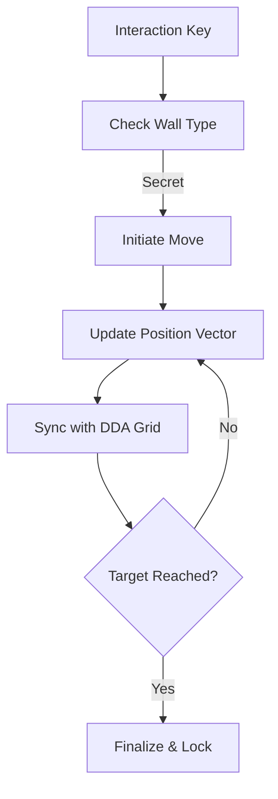

# 🧱 Pushable Wall Module (`srcs/gameplay/entities/push_wall`)

---

## 🚧 Subsystem Boundary
> [!NOTE]
> **Trigger:** Activated when the player interacts with a "Secret" wall segment.
> 
> **Output:** Slowly displaces a wall block, updating the DDA collision grid in real-time.

---

## ✅ Responsibilities & ❌ Anti-Responsibilities
- **Must:** Handle the sliding movement of secret wall blocks.
- **Must:** Synchronize the visual position with the physical collision grid.
- **Must:** Reset or lock the wall state once the movement is complete.
- **Must Not:** Handle standard door logic (delegated to `door/`).
- **Must Not:** Handle raycasting (delegated to `engine/render/`).

---

## 🔄 Interaction Pipeline

---

## 🧬 Interaction Matrix
| Phase | Function | Role |
| :--- | :--- | :--- |
| **Trigger** | `interact.c` | Identifies if the target wall is pushable. |
| **Movement** | `tick.c` | Updates the world coordinates of the block. |
| **Physics** | `sync.c` | Swaps grid cells between '1' (Wall) and '0' (Empty). |

---

## ⚠️ Edge Cases & Gotchas
> [!CAUTION]
> **Grid Syncing:** If the grid cell isn't updated *while* the wall is moving, the player might walk through the moving wall or get blocked by empty space. The `sync.c` module must carefully manage the "partial cell" state.

---

## 🗂️ Files Inventory
| File | Primary Function | Role |
| :--- | :--- | :--- |
| `tick.c` | `push_wall_tick()` | Primary update logic for moving blocks. |
| `interact.c` | `push_wall_trigger()` | Activation logic for secret passages. |
| `sync.c` | `push_wall_sync()` | Grid-to-world synchronization. |
