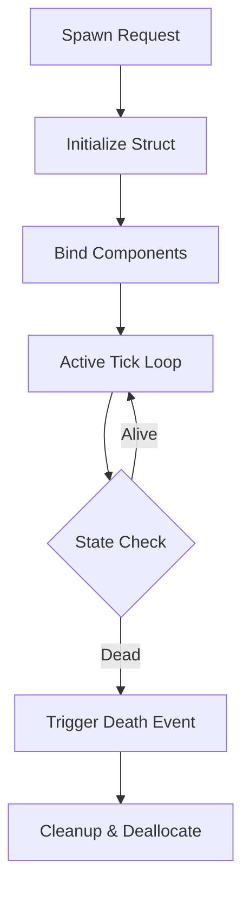

# ⚙️ Entity System Core (`srcs/gameplay/entities/system`)

---

## 🚧 Subsystem Boundary
> [!NOTE]
> **Trigger:** Initialized by the gameplay core and ticked every frame.
> 
> **Output:** Orchestrates the lifecycle of every dynamic object in the world, ensuring state consistency and component updates.

---

## ✅ Responsibilities & ❌ Anti-Responsibilities
- **Must:** Manage the global entity list (spawn/despawn).
- **Must:** Initialize entity components (Combat, AI, Animation).
- **Must:** Dispatch tick events to all active entity sub-modules.
- **Must Not:** Handle pixel rendering (delegated to `engine/render/`).
- **Must Not:** Handle raw map data (delegated to `helpers/parser/`).

---

## 🔄 Entity Lifecycle

---

## 🧬 Component Matrix
| Component | Module | Responsibility |
| :--- | :--- | :--- |
| **Animation** | `anim.c` | Syncs entity state with visual frames. |
| **Combat** | `combat.c` | Handles HP, damage, and death triggers. |
| **State** | `state.c` | Manages high-level behavioral flags. |
| **Spawner** | `spawn.c` | Factory for creating new entity instances. |

---

## ⚠️ Edge Cases & Gotchas
> [!CAUTION]
> **Entity Limits:** To prevent memory exhaustion and performance degradation, the system must enforce a maximum cap on concurrent active entities (projectiles, monsters, items).

---

## 🗂️ Files Inventory
| File | Primary Function | Role |
| :--- | :--- | :--- |
| `tick.c` | `entities_tick()` | Central dispatcher for all entity updates. |
| `init.c` | `entities_init()` | Global setup of entity registries. |
| `spawn.c` | `entity_spawn()` | factory method for world objects. |
