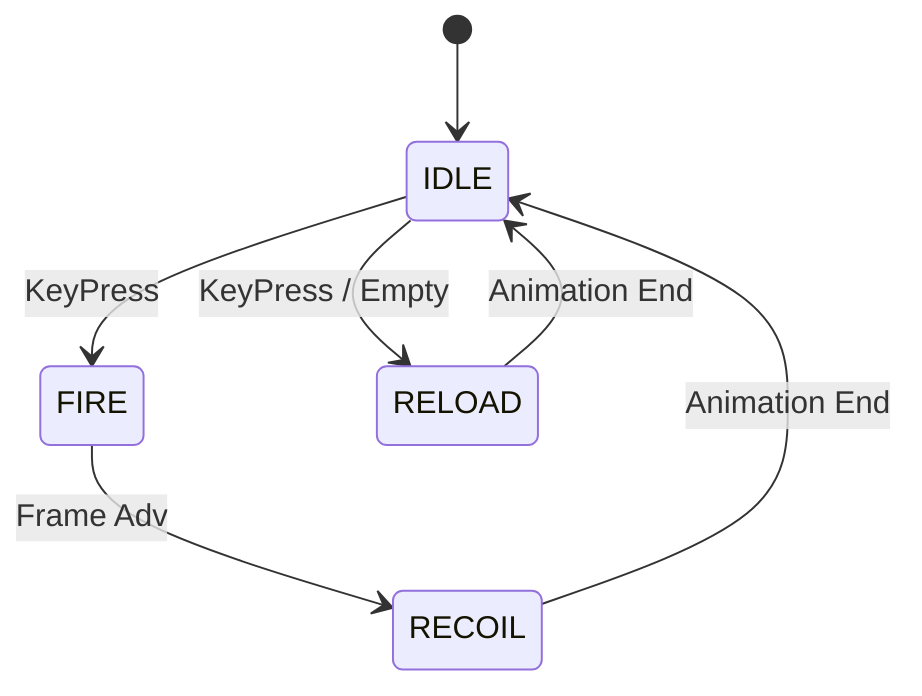

# 🔫 Weapon Subsystem (`srcs/gameplay/entities/weapon`)

---

## 🚧 Subsystem Boundary
> [!NOTE]
> **Trigger:** Activated by the player's primary fire key or weapon switch commands.
> 
> **Output:** Mutates the weapon state and triggers projectile spawns or ray-casts for combat.

---

## ✅ Responsibilities & ❌ Anti-Responsibilities
- **Must:** Manage weapon states (IDLE, FIRE, RELOAD, SWAP).
- **Must:** Implement weapon "sway" and movement paths for visual realism.
- **Must:** Synchronize animation frames with the fire-rate of the weapon.
- **Must Not:** Handle projectile physics (delegated to `projectile/`).
- **Must Not:** Draw pixels (delegated to `engine/render/`).

---

## 🔄 Weapon State Machine

---

## 🧬 Weapon Logic Matrix
| Feature | Implementation | Purpose |
| :--- | :--- | :--- |
| **Sway** | `path.c` | Sinusoidal movement based on player velocity. |
| **Timing** | `tick.c` | Frame-independent cooldown management. |
| **Setup** | `init.c` | Loads texture sets and offsets for each weapon type. |

---

## ⚠️ Edge Cases & Gotchas
> [!WARNING]
> **Animation Sync:** If the frame rate drops, the weapon animation must not "slow down". The `tick.c` module uses delta-time to ensure the fire-rate remains consistent.

---

## 🗂️ Files Inventory
| File | Primary Function | Role |
| :--- | :--- | :--- |
| `tick.c` | `weapon_tick()` | Primary update loop for the active weapon. |
| `path.c` | `weapon_get_sway()` | Calculates visual offsets for the weapon sprite. |
| `init.c` | `weapon_init()` | Factory for initializing player armaments. |
