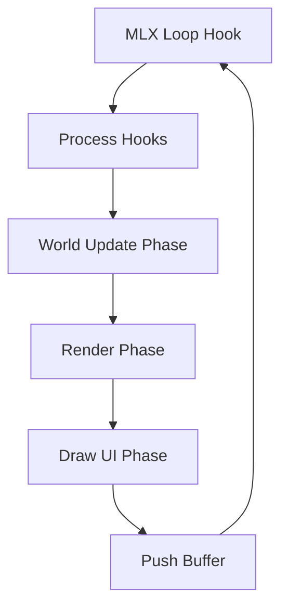

# 🔄 Gameplay Loop Hub (`srcs/gameplay/loop`)

---

## 🚧 Subsystem Boundary
> [!NOTE]
> **Trigger:** Initialized at startup and handed over to `mlx_loop()`.
> 
> **Output:** Drives the continuous cycle of Input -> Update -> Render that forms the playable game experience.

---

## ✅ Responsibilities & ❌ Anti-Responsibilities
- **Must:** Orchestrate the high-level flow of each frame.
- **Must:** Synchronize asset loading with loop initialization.
- **Must:** Handle high-level player interactions (e.g., Opening doors via ray-cast).
- **Must Not:** Perform low-level raycasting (delegated to `engine/render/`).
- **Must Not:** Handle raw memory allocation for textures (delegated to `primitives/textures/`).

---

## 🔄 Execution Cycle

---

## 🧬 Orchestration Matrix
| Component | Module | Responsibility |
| :--- | :--- | :--- |
| **Hooks** | `hooks/` | Interface with MLX event system. |
| **Update** | `update/` | Logic, Physics, and Animation ticking. |
| **Interaction** | `interaction.c` | Ray-based "Use" triggers. |
| **Rendering** | `render.c` | Calls the engine to draw the frame. |

---

## ⚠️ Edge Cases & Gotchas
> [!IMPORTANT]
> **Frame Rate Coupling:** The gameplay loop must distinguish between *Input* (event-driven) and *Update* (time-driven). Logic should always use delta-time to ensure consistent speed across hardware.

---

## 🗂️ Files Inventory
| File | Primary Function | Role |
| :--- | :--- | :--- |
| `init.c` | `loop_init()` | Setup of MLX hooks and initial state. |
| `render.c` | `loop_render()` | Wrapper for the rendering engine calls. |
| `interaction.c` | `player_interact()` | Handles "Use" key raycasting logic. |
| `assets.c` | `load_game_assets()` | Orchestrates asset retrieval during boot. |
