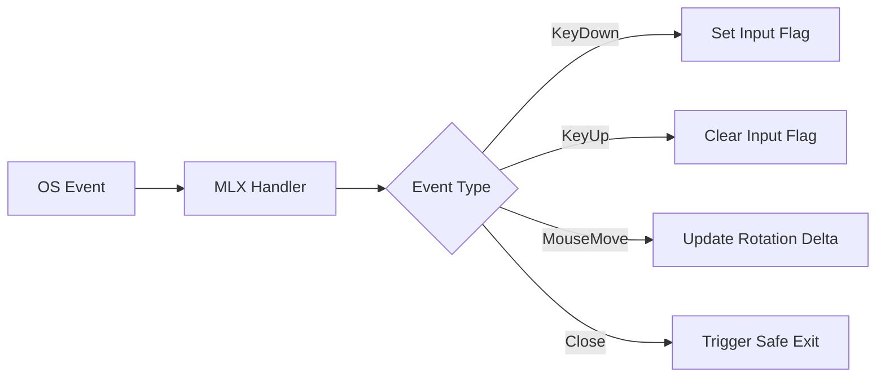

# 🪝 MLX Event Hooks (`srcs/gameplay/loop/hooks`)

---

## 🚧 Subsystem Boundary
> [!NOTE]
> **Trigger:** Triggered by X11/Cocoa events passed through the MiniLibX library.
> 
> **Output:** Updates the `t_input` state structure, which is then consumed by the movement and combat engines.

---

## ✅ Responsibilities & ❌ Anti-Responsibilities
- **Must:** Map raw keycodes to logical game actions (Forward, Back, Shoot).
- **Must:** Capture mouse delta for smooth camera rotation.
- **Must:** Handle the "Destroy Window" event for safe application exit.
- **Must Not:** Resolve movement physics (delegated to `gameplay/entities/player/`).
- **Must Not:** Perform UI rendering (delegated to `engine/render/draw/`).

---

## 🔄 Event Flow

---

## 🧬 Hook Matrix
| Event | Handler | Game Action |
| :--- | :--- | :--- |
| **`KeyPress`** | `on_keypress()` | Toggles movement/combat flags. |
| **`KeyRelease`** | `on_keyrelease()` | Stops movement/combat actions. |
| **`MouseMove`** | `on_mousemove()` | Updates horizontal viewing angle. |
| **`Loop`** | `main_loop()` | Orchestrates the per-frame update. |

---

## ⚠️ Edge Cases & Gotchas
> [!CAUTION]
> **Keyboard Ghosting:** The input system must track the state of multiple simultaneous keypresses (e.g., Forward + Left + Shoot) to ensure fluid gameplay without input blocking.

---

## 🗂️ Files Inventory
| File | Primary Function | Role |
| :--- | :--- | :--- |
| `events.c` | `register_hooks()` | Binds C functions to MLX event IDs. |
| `loop.c` | `render_hook()` | The primary callback executed every frame. |
