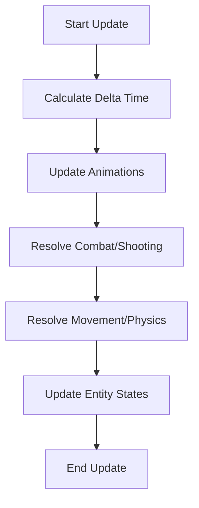

# 📈 World State Updater (`srcs/gameplay/loop/update`)

---

## 🚧 Subsystem Boundary
> [!NOTE]
> **Trigger:** Called exactly once per frame by the main loop handler.
> 
> **Output:** Advances the world clock, resolves all gameplay mechanics, and prepares the data for the next render pass.

---

## ✅ Responsibilities & ❌ Anti-Responsibilities
- **Must:** Resolve player and monster movement physics.
- **Must:** Update all active animation timers.
- **Must:** Handle combat logic (shooting, damage, health).
- **Must:** Calculate FPS and frame-time (delta-time) values.
- **Must Not:** Draw anything to the image buffer (delegated to `engine/render/`).
- **Must Not:** Handle raw input events (delegated to `hooks/`).

---

## 🔄 Update Pipeline

---

## 🧬 Update Matrix
| Component | Module | Purpose |
| :--- | :--- | :--- |
| **Animation** | `anim.c` | Ticks global and local animation frames. |
| **Physics** | `gameplay.c` | Resolves world-space collisions and positions. |
| **Combat** | `shooting.c` | Handles weapon firing and hit detection. |
| **Time** | `fps.c` | Manages clock synchronization. |

---

## ⚠️ Edge Cases & Gotchas
> [!IMPORTANT]
> **Delta-Time Decoupling:** All updates (movement, rotation, animation) MUST be multiplied by the `delta_time` value stored in `fps.c` to ensure the game speed is identical on both slow and fast machines.

---

## 🗂️ Files Inventory
| File | Primary Function | Role |
| :--- | :--- | :--- |
| `update.c` | `world_update()` | Primary orchestrator for the update phase. |
| `gameplay.c` | `update_player()` | High-level movement and collision dispatcher. |
| `shooting.c` | `update_combat()` | Triggers weapon fire logic based on input. |
| `anim.c` | `update_anims()` | Global animation frame accumulator. |
| `fps.c` | `update_clock()` | Manages the internal high-resolution timer. |
