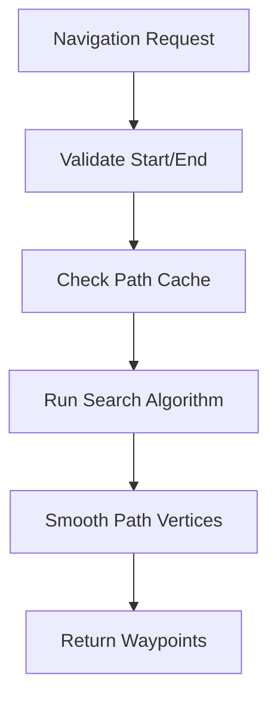

# 🧭 Pathfinder Engine (`srcs/gameplay/pathfinder`)

---

## 🚧 Subsystem Boundary
> [!NOTE]
> **Trigger:** Triggered by monster AI or world triggers requiring navigation data.
> 
> **Output:** Returns a sequence of grid coordinates (path) or a boolean validation of reachability.

---

## ✅ Responsibilities & ❌ Anti-Responsibilities
- **Must:** Resolve high-level "can I go there?" queries.
- **Must:** Orchestrate multi-step navigation for NPCs.
- **Must:** Integrate with the world grid and door states.
- **Must Not:** Handle physical movement (delegated to `entities/monster/move/`).
- **Must Not:** Perform raycasting for LOS (delegated to `engine/physics/dda/`).

---

## 🔄 Navigation Pipeline

---

## 🧬 Pathfinder Matrix
| Feature | Implementation | Purpose |
| :--- | :--- | :--- |
| **Validation** | `validate.c` | Rapid check for basic reachability. |
| **Stepping** | `step.c` | Calculates the next immediate waypoint. |
| **Reachability** | `has.c` | Boolean check for static connectivity. |
| **Core** | `internal/` | Low-level search implementation. |

---

## ⚠️ Edge Cases & Gotchas
> [!IMPORTANT]
> **Dynamic Obstacles:** The pathfinder must account for doors. A path that is valid now might be blocked in 2 seconds. The `step.c` module re-validates the immediate path every tick.

---

## 🗂️ Files Inventory
| File | Primary Function | Role |
| :--- | :--- | :--- |
| `validate.c` | `path_is_valid()` | High-level sanity check for target points. |
| `step.c` | `get_next_step()` | Returns the direction for the next grid move. |
| `has.c` | `has_direct_path()` | Optimized check for non-obstructed paths. |
