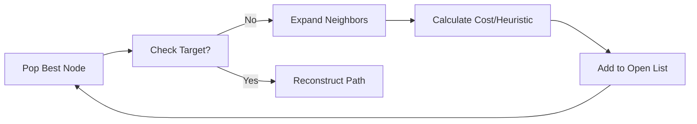

# 🧠 Pathfinding Algorithms (`srcs/gameplay/pathfinder/internal`)

---

## 🚧 Subsystem Boundary
> [!NOTE]
> **Trigger:** Called by the high-level pathfinder when a full search is required.
> 
> **Output:** Executes the core search loop and populates node metadata for path reconstruction.

---

## ✅ Responsibilities & ❌ Anti-Responsibilities
- **Must:** Implement memory-efficient grid search (e.g., A* or Breadth-First).
- **Must:** Manage the open/closed lists for node exploration.
- **Must:** Check grid cell passability (walls vs empty space).
- **Must Not:** Handle high-level AI state (delegated to `entities/monster/ai/`).
- **Must Not:** Handle world-space coordinates (operates purely on grid indices).

---

## 🔄 Search Logic

---

## 🧬 Algorithm Matrix
| Feature | Implementation | Notes |
| :--- | :--- | :--- |
| **Search** | `search.c` | Core loop and heuristic calculations. |
| **Passability** | `passable.c` | Interface with the `t_world` grid data. |
| **Expansion** | `step.c` | neighbor discovery and bounds checking. |

---

## ⚠️ Edge Cases & Gotchas
> [!CAUTION]
> **Memory Allocation:** Searching large maps can require thousands of nodes. The `init.c` module uses a pre-allocated node pool to avoid heap fragmentation during intensive search cycles.

---

## 🗂️ Files Inventory
| File | Primary Function | Role |
| :--- | :--- | :--- |
| `search.c` | `run_search()` | The core A*/BFS algorithm loop. |
| `passable.c` | `is_cell_passable()` | Determines if a grid coordinate is blocked. |
| `init.c` | `search_init()` | Resets the node pool for a new search. |
